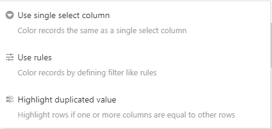
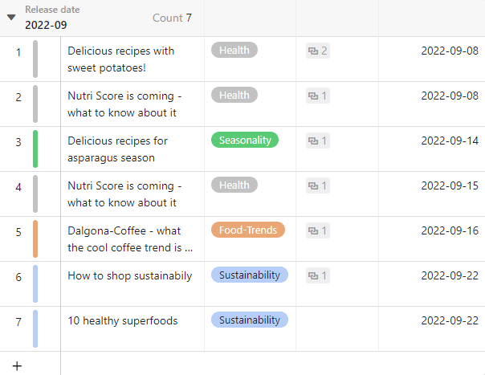
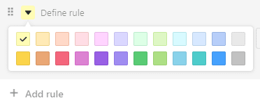
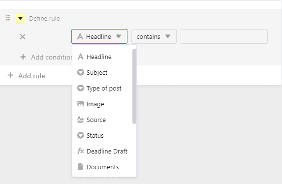
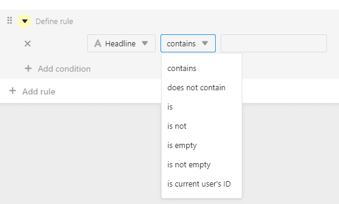
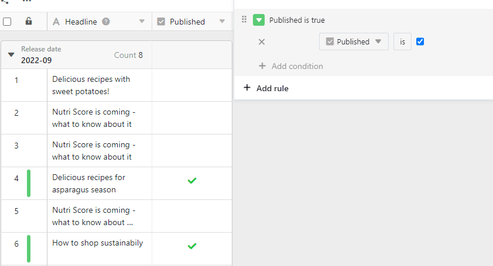
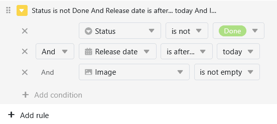
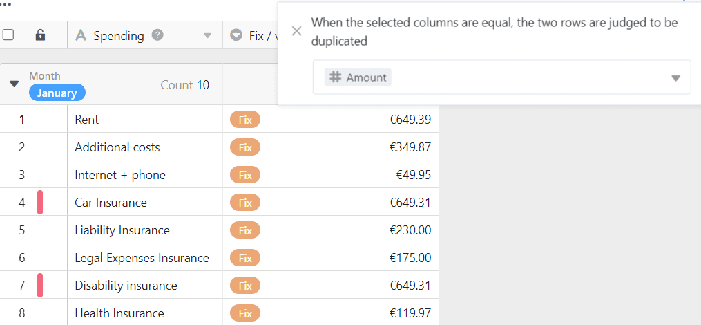

Pode utilizar a **ferramenta de formatação de linhas para** definir marcas coloridas no **início das linhas**. A **marcação** a cores **das filas** serve para identificar rapidamente certos registos de dados. Isto não deve ser confundido com [células de coloração](), o que lhe permite destacar células individuais.

## A ferramenta de formato de linha

Nas opções de visualização acima de uma tabela encontrará o seguinte símbolo:

Depois de clicar na ferramenta line-format, pode escolher entre **três opções** para a marcação a cores:

- Utilizar uma única coluna de selecção
- Regras de utilização
- Destacar duplicados

## Utilizar uma única coluna de selecção

Para a opção **Utilizar coluna de seleção única**, é necessária uma coluna deste tipo na tabela. Isto permite-lhe marcar cada linha no **início da linha** com a cor da respectiva opção que é introduzida nesta coluna.



Descubra [aqui]() como criar novas colunas de seleção simples.



## Regras de utilização

A opção **Regras de Utilização** permite-lhe definir condições para a marcação por cor.

- Clique no botão **símbolo de triângulo colorido**para mudar a cor do marcador.
  
- Determine qual dos seus **Colunas** a condição deve referir-se a.
  
- Decidir a favor do **Tipo de condição**.
  



### Usar exemplo de regra

Neste exemplo, todas as linhas de um plano editorial que estão marcadas como concluídas na [coluna da caixa de verificação]() devem ser destacadas. Para tal, foi selecionada a **coluna "Publicado"**, foi utilizada a condição **"é"** e foi especificado que as linhas **com um visto** devem ser marcadas.

### Exemplo de uma regra com várias condições

Neste exemplo, só queremos destacar as linhas do plano editorial a cores se o **estado** da publicação não estiver "terminado", se a **data de publicação** estiver no futuro e se já existir uma **imagem** disponível.

## Destacar duplicados

Pode destacar linhas com um ou mais valores de coluna idênticos utilizando a opção **Destacar Duplicações**. Para o fazer, seleccione a coluna que pretende verificar se existem duplicados. Desta forma pode facilmente identificar duplicados na sua mesa e corrigi-los ou eliminá-los, se necessário.

