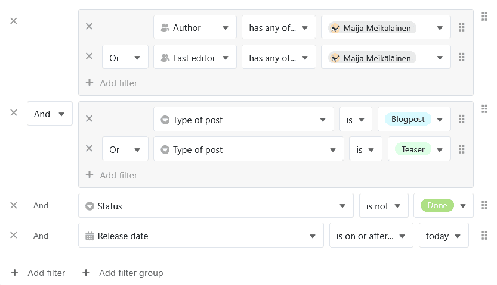

Sie können beim [Filtern von Einträgen in einer Ansicht]() auch **mehrere Filter-Regeln** erstellen, um die Bedingungen zu verfeinern und die zutreffenden Einträge weiter einzugrenzen. Hierbei wird zwischen der **Und-Verknüpfung** und der **Oder-Verknüpfung** unterschieden. Mithilfe von **Filtergruppen** können Sie die logischen Und-/Oder-Verknüpfungen auch kombinieren.

## Warum Filter-Regeln Ihnen die Arbeit erleichtern

Um effizient arbeiten und sich auf das Wesentliche konzentrieren zu können, müssen Sie die **aktuell für Sie relevanten Informationen** aus einer **großen Datenmenge** herausfiltern können. Deshalb ermöglicht SeaTable eine optimale Filterung von Datensätzen, bei der Sie **mehrere Filter-Regeln** nach diesem Schema miteinander verknüpfen können:

## Die Und-Verknüpfung

Bei der **Und-Verknüpfung** müssen alle festgelegten Bedingungen auf einen Datensatz zutreffen, damit er angezeigt wird.

Dieses Beispiel demonstriert das folgende Video: Wir befinden uns in der Ansicht eines Redaktionsplans mit zahlreichen Posts. Zuerst haben wir in der [Einfachauswahl-Spalte]() **"Status"** nach allen Posts gefiltert, die **nicht fertig** sind. Diese Datenmenge haben wir durch den zweiten Filter weiter eingegrenzt, um nur Posts vom **Typ "Blogpost"** angezeigt zu bekommen. Nun sehen wir, welche Blogposts noch nicht fertig sind.

## Die Oder-Verknüpfung

Bei der **Oder-Verknüpfung** sind die Bedingungen voneinander unabhängig. Es reicht, wenn die angezeigten Datensätze eine der Bedingungen erfüllen – sie können aber auch mehrere bzw. alle Bedingungen erfüllen.

Hier ein Beispiel (siehe Screenshot): Obwohl wir mit der ersten Filter-Regel in der **"Status"-Spalte** nach geplanten Posts ("Planned") filtern, werden auch Einträge mit anderem Status angezeigt, wenn sie als "Blogpost" die zweite Bedingung der Textart erfüllen. Bei der zweiten Filter-Regel in der **"Type of post"-Spalte** gehen wiederum auch andere Textarten durch, wenn der Status "Planned" ist. Auch geplante Blogposts, die beide Bedingungen erfüllen, erscheinen in der gefilterten Ansicht.

## Filtergruppen

Wenn Sie mehrere **einzelne Filter-Regeln** definieren, dann können Sie die logischen Und-/Oder-Verknüpfungen **nicht** miteinander kombinieren, sondern sich nur einmal entscheiden, wie alle folgenden Filter-Regeln verknüpft werden sollen.

Mithilfe von **Filtergruppen** können Sie hingegen **Und-/Oder-Verknüpfungen kombinieren**. So sind sehr komplexe Filter-Regeln umsetzbar, die Ihnen unzählige Möglichkeiten zur Datenanalyse eröffnen:

In diesem Beispiel möchte die Mitarbeiterin **Maija Meikälainen** alle Posts herausfiltern, für die sie als **Autorin oder Redakteurin** verantwortlich ist. Zudem sollen nur Posts vom Typ **Blogpost oder Teaser** angezeigt werden. Darüber hinaus sollen die Posts noch **nicht fertig** und **unveröffentlicht** sein.
