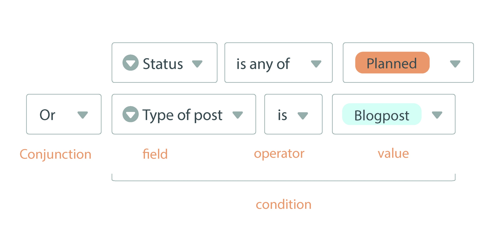

When [filtering entries in a view](), you can also create **multiple filter rules** to refine the conditions and further narrow down the applicable entries. A distinction is made here between the **AND link** and the **OR link**. You can also use **filter groups** to combine the logical AND/Or links.

## Why filter rules make your work easier

In order to work efficiently and concentrate on the essentials, you need to be able to filter out the **information that is currently relevant to you** from a **large amount of data**. That's why SeaTable allows you to filter data records optimally by linking **several filter rules** according to this scheme:

## The ampersand

With the **And link**, all specified conditions must apply to a record for it to be displayed.

This example is demonstrated in the following video: We are in the view of an editorial plan with numerous posts. First, we filtered the [single selection column]() **"Status"** for all posts that are **not finished**. We have further narrowed down this data set using the second filter to only display posts of the **type "Blog post"**. Now we can see which blog posts are not yet finished.

## The Oder link

In the case of the **OR link**, the conditions are independent of each other. It is enough if the displayed records fulfill one of the conditions - but they can also fulfill several or all conditions.

Here is an example (see screenshot): Although we filter for planned posts ("Planned") with the first filter rule in the **"Status" column**, entries with a different status are also displayed if they fulfill the second condition of the text type as "Blog post". With the second filter rule in the **"Type of post" column**, other text types also go through if the status is "Planned". Planned blog posts that fulfill both conditions also appear in the filtered view.

## Filter groups

If you define several **individual filter rules**, you **cannot** combine the logical and/or links with each other, but can only decide once how all subsequent filter rules should be linked.

With the help of **filter groups**, on the other hand, you can **combine and-or links**. This allows you to implement very complex filter rules that open up countless possibilities for data analysis:

In this example, the employee **Maija Meikälainen** wants to filter out all posts for which she is responsible as an **author or editor**. In addition, only posts of the type **blog post or teaser** should be displayed. In addition, the posts should **not** yet be **finished** and **unpublished**.
