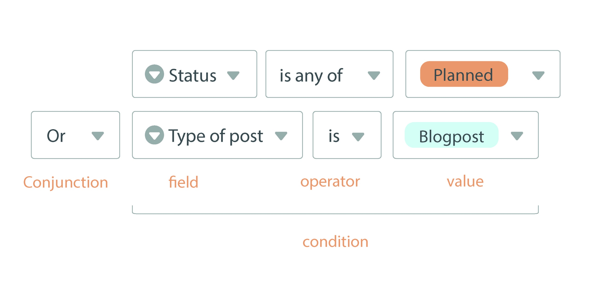
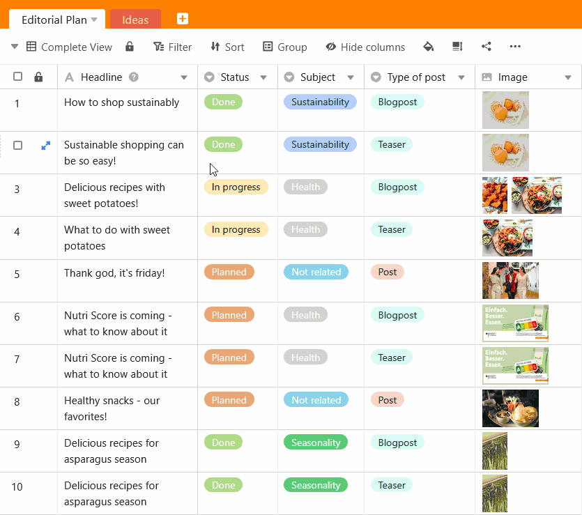
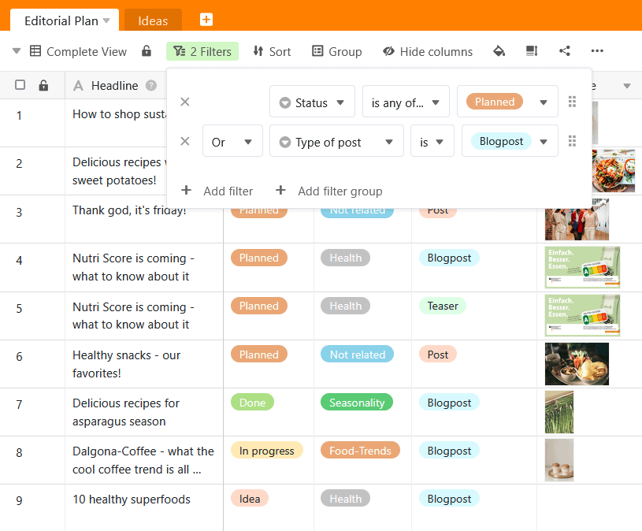
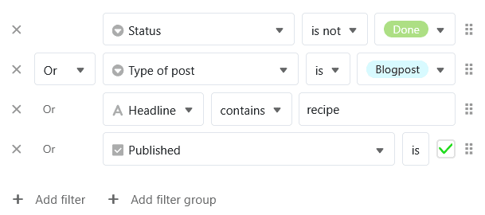
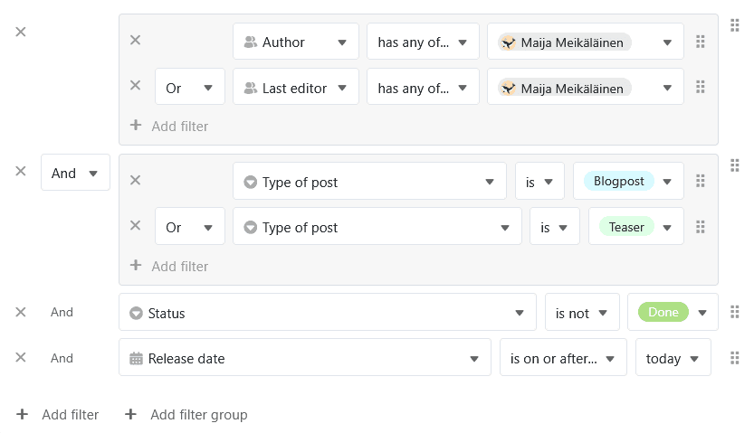

Al [filtrar entradas en una vista](https://seatable.io/es/docs/ansichtsoptionen/filtern-von-eintraegen-in-einer-ansicht/), también puede crear **múltiples reglas de filtrado** para refinar las condiciones y reducir aún más las entradas aplicables. Aquí se distingue entre el **enlace** **Y** y el enlace **O**. También puede utilizar **grupos de filtros** para combinar los enlaces lógicos Y/O.

## Por qué las reglas de filtrado facilitan el trabajo

Para poder trabajar con eficacia y concentrarse en lo esencial, necesita poder filtrar de una **gran cantidad de datos** la **información que le interesa en cada momento**. Por eso SeaTable le permite optimizar el filtrado de los registros de datos enlazando **varias reglas de filtrado** según este esquema:

## El y el enlace

Con el **enlace Y**, todas las condiciones especificadas deben aplicarse a un registro para que se muestre.

Este ejemplo se muestra en el siguiente vídeo: Estamos en la vista de un plan editorial con numerosos posts. En primer lugar, filtramos la [columna de selección única](https://seatable.io/es/docs/auswahlspalten/anlegen-einer-einfachauswahl-spalte/) **"Estado"** para todos los posts que **no** están **finalizados**. Hemos reducido aún más este conjunto de datos utilizando el segundo filtro para mostrar sólo las entradas del **tipo "Entrada de blog"**. Ahora podemos ver qué entradas de blog aún no han finalizado.

## El enlace del Oder

Con la **vinculación OR**, las condiciones son independientes entre sí. Basta con que los registros de datos visualizados cumplan una de las condiciones, pero también pueden cumplir varias o todas.

He aquí un ejemplo (véase la captura de pantalla): Aunque filtramos las entradas planificadas ("Planned") con la primera regla de filtrado en la columna **"Status"**, las entradas con un estado diferente también se muestran si cumplen la segunda condición del tipo de texto como "Blog post". Con la segunda regla de filtrado en la columna " **Tipo de entrada** ", también se muestran otros tipos de texto si el estado es "Planificado". Las entradas de blog planificadas que cumplen ambas condiciones también aparecen en la vista filtrada.

## Filtrar grupos

Si define varias reglas de filtrado **individuales**, **no podrá** combinar los enlaces lógicos y/o entre sí, sino que sólo podrá decidir una vez cómo deben enlazarse todas las reglas de filtrado posteriores.

Por otra parte, con la ayuda de **los grupos de filtros** puede **combinar enlaces y-o**. Esto permite aplicar reglas de filtrado muy complejas que abren innumerables posibilidades de análisis de datos:

En este ejemplo, la empleada **Maija Meikälainen** quiere filtrar todas las entradas de las que es responsable como **autora o editora**. Además, sólo deben mostrarse las entradas del tipo **entrada de blog o teaser**. Además, las entradas aún no deben estar **terminadas** **ni publicadas**.
