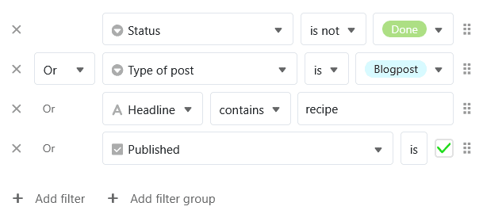

Lorsque vous [filtrez des entrées dans une vue](), vous pouvez également créer **plusieurs règles de filtrage** afin d'affiner les conditions et de limiter davantage les entrées qui s'appliquent. On fait ici la distinction entre la **combinaison "ET" et "OU"**. Les **groupes de filtres** permettent également de combiner les combinaisons logiques "ET" et "OU".

## Pourquoi les règles de filtrage vous facilitent la tâche

Pour travailler efficacement et vous concentrer sur l'essentiel, vous devez pouvoir filtrer les **informations actuellement pertinentes pour vous** dans une **grande quantité de données**. C'est pourquoi SeaTable permet un filtrage optimal des ensembles de données, en associant **plusieurs règles de filtrage** selon ce schéma :

## La conjonction "ET"

Dans le cas de la **conjonction "ET"**, toutes les conditions définies doivent s'appliquer à un enregistrement pour qu'il soit affiché.

Cet exemple est démontré dans la vidéo suivante : Nous nous trouvons dans la vue d'un plan éditorial avec de nombreux posts. Dans un premier temps, nous avons filtré tous les posts qui **n'étaient pas terminés** dans la [colonne de sélection simple]() **"Statut"**. Nous avons limité cette quantité de données en appliquant un deuxième filtre afin de n'afficher que les posts de **type "Blogpost"**. Nous voyons maintenant quels blog posts ne sont pas encore terminés.

## La conjonction "OU"

Dans le cas de la **conjonction "OU"**, les conditions sont indépendantes les unes des autres. Il suffit que les enregistrements affichés remplissent l'une des conditions - mais ils peuvent aussi remplir plusieurs, voire toutes les conditions.

Voici un exemple (voir capture d'écran) : Bien que nous filtrions les posts planifiés ("Planned") avec la première règle de filtrage dans la **colonne "Status"**, les entrées avec d'autres statuts sont également affichées si elles remplissent la deuxième condition du type de texte en tant que "Blogpost". Pour la deuxième règle de filtrage dans la **colonne "Type of post"**, d'autres types de texte passent également si le statut est "Planned". Les blog post planifiés qui remplissent les deux conditions apparaissent également dans la vue filtrée.

## Groupes de filtres

Si vous définissez plusieurs **règles de filtrage individuelles**, vous ne pouvez **pas** combiner les combinaisons logiques Et/Ou, mais vous ne pouvez décider qu'une seule fois de la manière dont toutes les règles de filtrage suivantes doivent être combinées.

En revanche, les **groupes de filtres** vous permettent de **combiner des combinaisons "et" et "ou"**. Il est ainsi possible de mettre en œuvre des règles de filtrage très complexes, qui vous ouvrent d'innombrables possibilités d'analyse des données :

Dans cet exemple, la collaboratrice **Maija Meikälainen** souhaite filtrer tous les posts dont elle est responsable en tant qu'**auteur ou rédacteur**. De plus, seuls les posts de type **blog post ou teaser** doivent être affichés. En outre, les posts ne doivent **pas** encore être **terminés** et **non publiés**.
