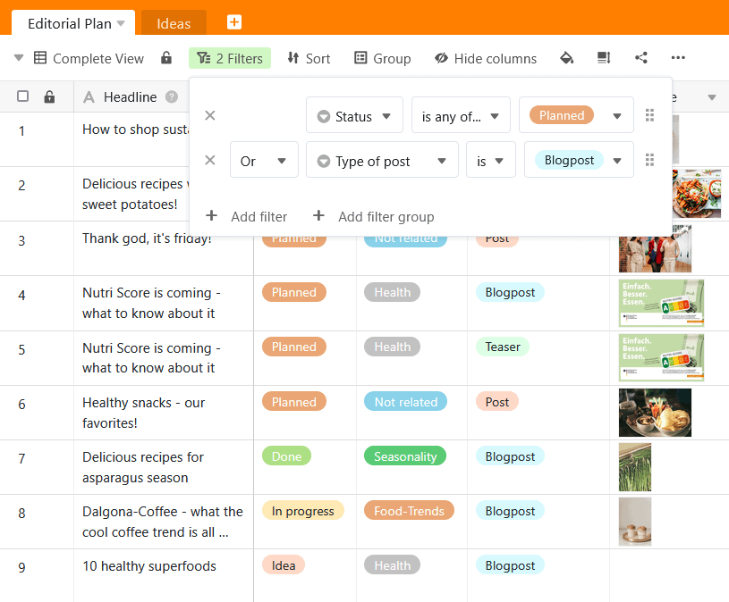

Ao [filtrar entradas numa vista](), também é possível criar **várias regras de filtragem** para refinar as condições e restringir ainda mais as entradas aplicáveis. É feita aqui uma distinção entre a **ligação E** e a **ligação OU**. Também é possível utilizar **grupos de filtros** para combinar as ligações lógicas E/Or.

## Porquê regras de filtragem que facilitam o seu trabalho

Para poder trabalhar de forma eficiente e concentrar-se no essencial, é necessário poder filtrar a **informação que é atualmente relevante para si a** partir de uma **grande quantidade de dados**. É por isso que o SeaTable permite otimizar a filtragem dos registos de dados, associando **várias regras de filtragem** de acordo com este esquema:

## O Enlaçamento

Com a **ligação E**, todas as condições especificadas devem aplicar-se a um registo para que este possa ser exibido.

Este exemplo é demonstrado no vídeo seguinte: Estamos a visualizar um plano editorial com várias publicações. Em primeiro lugar, filtrámos a [coluna de seleção única]() **"Estado"** para todos os posts que **não** estão **concluídos**. Reduzimos ainda mais este conjunto de dados utilizando o segundo filtro para apresentar apenas as publicações do **tipo "Publicação de blogue"**. Agora podemos ver quais os posts do blogue que ainda não estão concluídos.

## A ligação Oder

Com a **ligação OR**, as condições são independentes uma da outra. É suficiente se os registos de dados apresentados preencherem uma das condições - mas também podem preencher várias ou todas as condições.

Eis um exemplo (ver imagem do ecrã): Embora filtremos as mensagens planeadas ("Planeado") com a primeira regra de filtragem na **coluna "Estado"**, as entradas com um estado diferente também são apresentadas se cumprirem a segunda condição do tipo de texto como "Publicação de blogue". Com a segunda regra de filtragem na **coluna "Tipo de publicação"**, outros tipos de texto também são exibidos se o estado for "Planeado". As publicações planeadas no blogue que preenchem ambas as condições também aparecem na vista filtrada.

## Grupos de filtros

Se forem definidas várias **regras de filtragem individuais**, **não é possível** combinar as ligações lógicas e/ou entre si, mas só é possível decidir uma vez como todas as regras de filtragem subsequentes devem ser ligadas.

Por outro lado, com a ajuda dos **grupos de filtros**, é possível **combinar ligações e-ou**. Isto permite-lhe implementar regras de filtragem muito complexas que abrem inúmeras possibilidades de análise de dados:

Neste exemplo, a empregada **Maija Meikälainen** pretende filtrar todos os posts pelos quais é responsável como **autora ou editora**. Além disso, só devem ser apresentadas as mensagens do tipo **"blog post" ou "teaser"**. Além disso, as mensagens ainda **não** devem estar **concluídas** e **não publicadas**.
