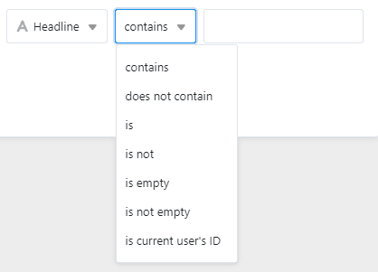

Mit der Filterfunktion von SeaTable können Sie über **Filterregeln** die gewünschten Einträge aus einer Tabelle herausfiltern und nur die Einträge anzeigen lassen, die bestimmte Kriterien erfüllen. Der eingestellte Filter bezieht sich lediglich auf **die aktive Ansicht**.

## Einträge in einer Ansicht filtern

1. Wählen Sie die **Ansicht** aus, in der Sie einen Filter setzen wollen.
2. Klicken Sie in den Ansichtsoptionen über der Tabelle auf **Filtern**.
3. Gehen Sie auf **Filter hinzufügen** oder **Filtergruppe hinzufügen**.
4. Wählen Sie im ersten Feld die **Spalte** aus, für die Sie eine Filterregel definieren wollen.
5. Legen Sie im mittleren Feld fest, nach welcher **Bedingung** die Einträge gefiltert werden sollen.
6. Entscheiden Sie im letzten Feld, auf welche **Option** oder welchen **Wert** sich die Bedingung beziehen soll.

## Die verschiedenen Bedingungen beim Filtern

Je nachdem, nach welchem **Spaltentyp** Sie filtern möchten, passen sich auch die Bedingungen an, die Sie auswählen können.

### Hier einige Beispiele

Diese Bedingungsoptionen haben Sie bei einer [Text-Spalte](https://seatable.io/docs/text-und-zahlen/die-spalten-text-und-formatierter-text/): 

Diese Bedingungsoptionen haben Sie bei einer [Einfachauswahl-Spalte](https://seatable.io/docs/auswahlspalten/anlegen-einer-einfachauswahl-spalte/): 

Diese Bedingungsoptionen haben Sie bei einer [Bild-Spalte](https://seatable.io/docs/dateien-und-bilder/die-bild-spalte/): 

## Einen Filter entfernen

Sie können erstellte Filter wieder **löschen**, indem Sie auf das **x-Symbol** klicken. 

## Mehrere Filter anwenden

Sie können einen oder mehrere Filter erstellen, welche die erste Bedingung weiter einschränken. Lesen Sie im Artikel [Filter-Regeln mit UND und ODER verknüpfen](https://seatable.io/docs/ansichtsoptionen/filter-regeln-mit-und-und-oder-verknuepfen/) mehr darüber.

## Filter neu anordnen

Sie können Filter verschieben und neu anordnen, indem Sie die Maus auf der **Grifffläche**  gedrückt halten, ziehen und loslassen. 
