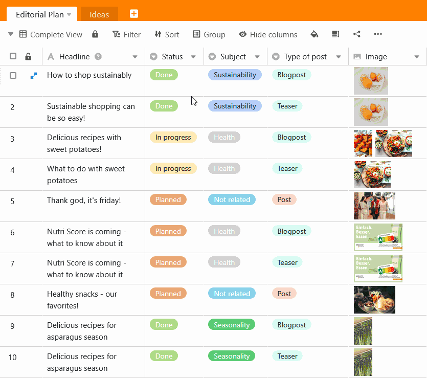
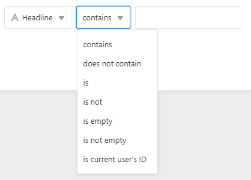
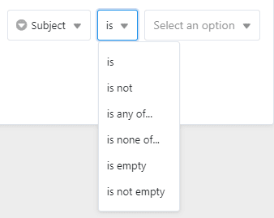
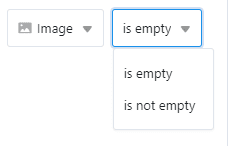
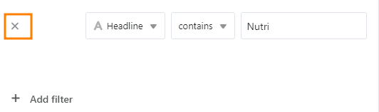
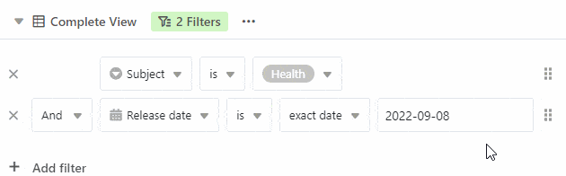

SeaTable's filter function allows you to use **filter rules** to filter out the desired entries from a table and display only those entries that meet certain criteria. The set filter refers only to the **active view**.

## Filter entries in a view

1. Select the **view in** which you want to set a filter.
2. Click **Filter** in the view options above the table.
3. Go to **Add filter** or **Add filter group**.
4. In the first field, select the **column** for which you want to define a filter rule.
5. In the middle field, specify the **condition** according to which the entries are to be filtered.
6. In the last field, decide which **option** or **value** the condition should refer to.

## The different conditions when filtering

Depending on the **column type** you want to filter by, the conditions you can select will also adjust.

### Here are some examples

You have these condition options with a [Text column]():  

You have these condition options with a [Single selection column]():  

You have these condition options with a [Image column]():  

## Remove a filter

You can restore created filters **delete**by clicking on the **x symbol** click.  

## Apply multiple filters

You can create one or more filters that further restrict the first condition. Read more about this in the article [Linking filter rules with AND and OR.]()

## Rearrange filters

You can move and rearrange filters by moving the mouse on the **Gripping surface**  Press and hold, pull and release.  

