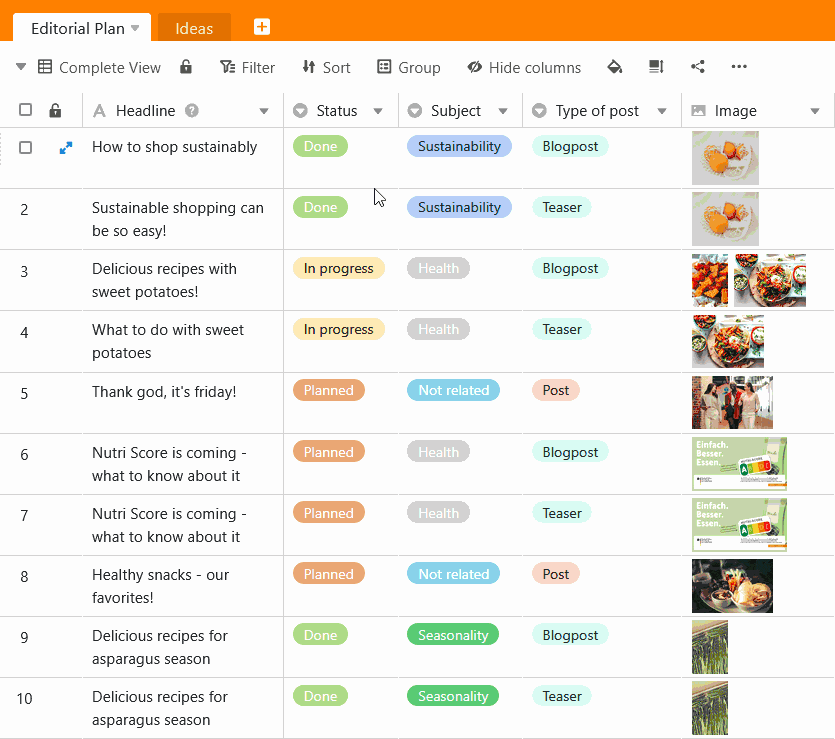

La fonction de filtre de SeaTable permet de filtrer les entrées souhaitées d'un tableau à l'aide de **règles de filtrage** et de n'afficher que les entrées qui répondent à certains critères. Le filtre défini se rapporte uniquement à **la vue active**.

## Filtrer les entrées d'une vue

1. Sélectionnez la **vue** dans laquelle vous souhaitez définir un filtre.
2. Cliquez sur **Filtrer** dans les options d'affichage au-dessus du tableau.
3. Allez sur **Ajouter un filtre** ou **Ajouter un groupe de filtres**.
4. Dans le premier champ, sélectionnez la **colonne** pour laquelle vous souhaitez définir une règle de filtrage.
5. Dans le champ central, déterminez la **condition** selon laquelle les entrées doivent être filtrées.
6. Dans le dernier champ, décidez à quelle **option** ou **valeur** la condition doit se référer.

## Les différentes conditions de filtrage

Selon le **type de colonne** que vous souhaitez filtrer, les conditions que vous pouvez sélectionner s'adaptent également.

### Voici quelques exemples

Voici les options de conditions dont vous disposez en cas de [Colonne de texte](https://seatable.io/fr/docs/text-und-zahlen/die-spalten-text-und-formatierter-text/):  

Voici les options de conditions dont vous disposez en cas de [Colonne de sélection simple](https://seatable.io/fr/docs/auswahlspalten/anlegen-einer-einfachauswahl-spalte/):  

Voici les options de conditions dont vous disposez en cas de [Colonne d'images](https://seatable.io/fr/docs/dateien-und-bilder/die-bild-spalte/):  

## Supprimer un filtre

Vous pouvez rétablir les filtres créés **supprimer**en cliquant sur le bouton **Symbole x** cliquer.  

## Appliquer plusieurs filtres

Vous pouvez créer un ou plusieurs filtres qui restreignent davantage la première condition. Pour en savoir plus, consultez l'article [Lier les règles de filtrage avec ET et OU](https://seatable.io/fr/docs/ansichtsoptionen/filter-regeln-mit-und-und-oder-verknuepfen/).

## Réorganiser les filtres

Vous pouvez déplacer et réorganiser les filtres en déplaçant la souris sur le **Surface de préhension**  maintenir enfoncé, tirer et relâcher.  

