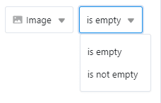
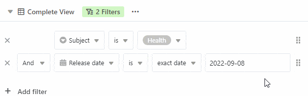

Com a função de filtro do SeaTable, é possível utilizar **regras de** filtragem para filtrar as entradas desejadas de uma tabela e exibir apenas as entradas que satisfazem determinados critérios. O conjunto de filtros refere-se apenas à **vista activa**.

## Filtrar entradas numa vista

1. Seleccione a **vista na** qual pretende definir um filtro.
2. Clique em **Filtrar** nas opções de visualização acima da tabela.
3. Ir para **Adicionar filtro** ou **Adicionar grupo de filtros**.
4. No primeiro campo, seleccione a **coluna** para a qual pretende definir uma regra de filtragem.
5. No campo do meio, definir a **condição** segundo a qual as entradas devem ser filtradas.
6. No último campo, decida qual a **opção** ou **valor** a que a condição se deve referir.

## As diferentes condições ao filtrar

Dependendo do **tipo de coluna** que se pretende filtrar, as condições que se podem seleccionar também se adaptam.

### Aqui estão alguns exemplos

Tem estas opções de condição com um [Coluna de texto]():  

Tem estas opções de condição com um [Coluna de seleção única]():  

Tem estas opções de condição com um [Coluna de imagem]():  

## Retirar um filtro

Pode restaurar filtros que tenha criado. **eliminar**clicando no **símbolo x** clique.  

## Aplicar vários filtros

Pode criar um ou mais filtros que restringem ainda mais a primeira condição. Leia mais sobre isto no artigo [Ligar as regras de filtragem com AND e OR]().

## Filtros de rearranjo

É possível mover e reorganizar os filtros movendo o rato sobre o **Superfície de agarrar**  Premir e manter, puxar e soltar.  

