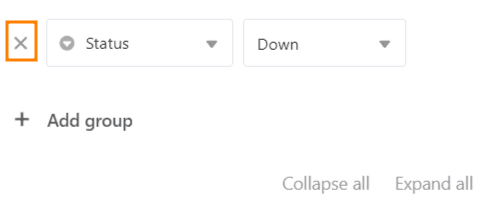

Mit der Gruppierungsfunktion können Sie **die Zeilen einer Tabelle in Gruppen zusammenfassen** und einfache deskriptive Statistiken wie die Anzahl der Zeilen in einer Gruppe oder die Summe und den Durchschnittswert von zahlenbasierten Spalten ermitteln. Die Gruppierung erfolgt über **identische Werte in der für die Gruppierung gewählten Spalte**.

## Einträge in einer Ansicht gruppieren

1. Erstellen Sie eine [neue Ansicht]() oder wählen Sie die Ansicht aus, in der Sie die Gruppierung vornehmen wollen.
2. Klicken Sie in den Ansichtsoptionen über der Tabelle die Option **Gruppieren** an.
3. Gehen Sie auf **Gruppierung hinzufügen**.
4. Wählen Sie im ersten Feld die **Spalte** aus, nach der Sie gruppieren wollen.
5. Entscheiden Sie im zweiten Feld, ob die Datensätze **aufsteigend** oder **absteigend** aufgelistet werden sollen.



Die Gruppierung wird **in Echtzeit** durchgeführt, d.h. die Datensätze werden noch vor Schließen des Fensters gruppiert. So können Sie unmittelbar sehen, ob Sie das gewünschte Ergebnis erzielt haben, und ggf. nachjustieren.

## Verschachtelte Gruppierungen

Sie können durch das Hinzufügen weiterer Gruppierungsregeln **nach bis zu drei Kriterien gleichzeitig gruppieren**. Dadurch entstehen mehrere Ebenen bzw. Untergruppen innerhalb der Gruppierungen.



## Gruppierung anpassen

Um die Gruppierung anzupassen, öffnen Sie das Fenster erneut durch Klick auf die Schaltfläche in den Ansichtseinstellungen. Genauso wie beim Hinzufügen der Gruppierungsregel können Sie nun die Regel anpassen. Zudem können Sie **die Hierarchie der Gruppierungsregeln ändern**, indem Sie die linke Maustaste auf der Sechs-Punkt-Greiffläche gedrückt halten und die Regel an die gewünschte Position ziehen.

## Gruppierungsverhalten nach Spaltentyp

SeaTable unterstützt Gruppierungen nach allen [Spaltentypen]() mit Ausnahme der Spaltentypen **Formatierter Text, Datei, Bild, automatische Nummer, Schaltfläche und digitale Signatur**.

Die Gruppierung erfolgt nach folgenden Ordnungsprinzipien:

- Text, E-Mail, URL, Telefonnummer: alphabetisch bzw. alphanumerisch
- Zahl, Dauer, Rating: numerisch
- Datum, Erstellt, Zuletzt bearbeitet: chronologisch
- Einfach- und Mehrfachauswahl: nach der Reihenfolge der Optionen
- Mitarbeiter, Ersteller, Letzter Bearbeiter: alphabetisch
- Checkbox: dichotom
- Formel: je nach Datentyp des Ergebnisses
- Verknüpfung: je nach Datentyp der referenzierten Spalte

Alle Zeilen **mit leeren Zellen in der Gruppierungsspalte** werden am unteren Ende der Ansicht in eine separate Gruppe namens (Empty) zusammengefasst.

## Der Gruppenheader

Jede Gruppe hat einen Header, in welchem sowohl das Kriterium der Gruppe als auch die Anzahl der Einträge innerhalb der Gruppe aufgeführt sind.

Bei **zahlenbasierten Spalten** haben Sie zudem die Möglichkeit, verschiedene Zusammenhänge der Werte in einer Gruppe darzustellen:

- Summe
- Durchschnitt
- Median
- Minimum
- Maximum
- Keine Berechnung

Klicken Sie auf das **dreieckige Drop-Down-Symbol** vor der Headline der Spalte, um die jeweilige Option auszuwählen.

## Reduzieren und erweitern der angezeigten Datensätze

Über das dreieckige **Drop-Down-Symbol** links im Gruppenheader können Sie die Anzeige der Datensätze in jeder einzelnen Gruppe **individuell** reduzieren und erweitern.

Durch die Optionen **Alle reduzieren** oder **Alle erweitern** können Sie die Anzeige der Datensätze mit einem Klick in allen Gruppen einklappen und wieder ausklappen.

### Alle reduzieren

Hier finden Sie die Option **Alle reduzieren**:

Die Anzeige mit aktivierter Option **Alle reduzieren**:

### Alle erweitern

Hier finden Sie die Option **Alle erweitern**:

Die Anzeige mit aktivierter Option **Alle erweitern**:

## Einträge in eine andere Gruppe verschieben

Sie können per Drag-and-Drop einzelne Zeilen neuen Gruppen zuordnen. Hierbei wird das Kriterium, auf dem die Gruppe basiert, beim verschobenen Eintrag angepasst.

## Gruppierung aufheben

Natürlich können Sie Gruppierungen jederzeit wieder löschen, indem Sie auf das **x-Symbol** vor der jeweiligen Gruppierung klicken.

