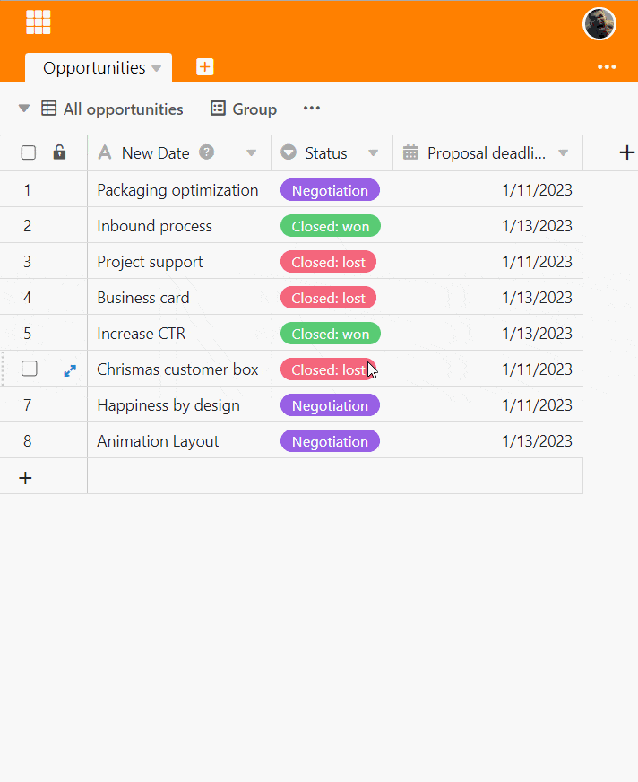
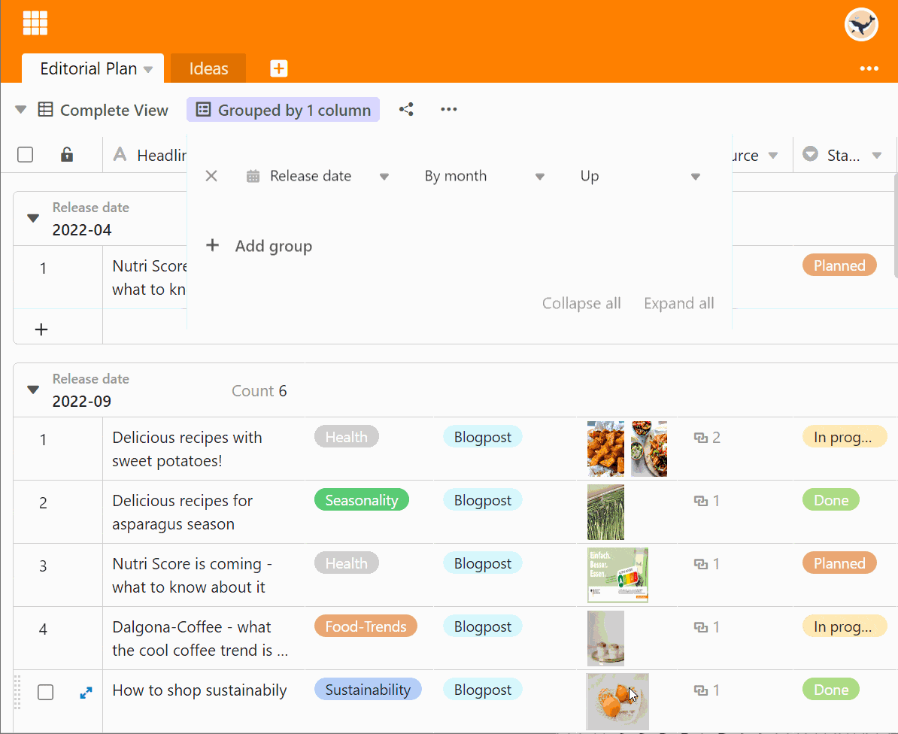
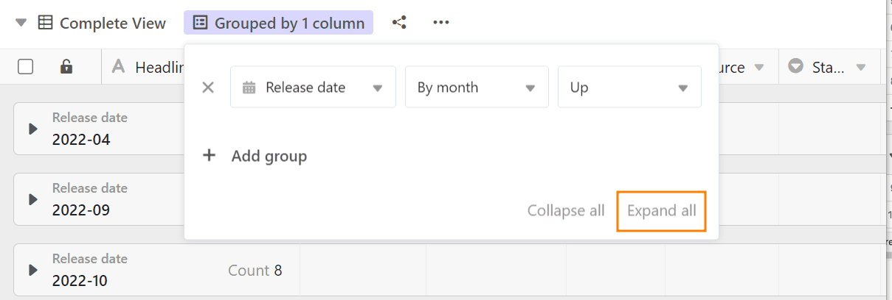

The grouping function allows you to combine table records into **groupings** and calculate simple descriptive statistics such as the number of elements or totals and averages of number columns. The grouping is carried out using **identical values in the column selected for the grouping**.

## Group records in a view

1. Create a [new view]() or select the view in which you want to group.
2. Click the **Group** option in the view options above the table.
3. Go to **Add group**.
4. In the empty field, select the **column** by which you want to group.
5. In the second field, decide whether the grouping should be listed in **ascending** or **descending** order.



The grouping is carried out **in real time**, i.e. the data records are grouped before the window is closed. This allows you to see immediately whether you have achieved the desired result and make any necessary adjustments.

## Nested groupings

You can **group** by adding further groupings **according to up to three criteria at the same time**. This creates multiple levels or subgroups within the groupings.



## Customize grouping

To adjust the grouping, open the window again by clicking on the button in the view settings. Just as when adding the grouping rule, you can now customize the rule. You can also **change the hierarchy of the grouping rules** by holding down the left mouse button on the six-point grip area and dragging the rule to the desired position.

## Grouping behavior by column type

SeaTable supports grouping by all [column types]() except the column types **Formatted Text, File, Image, Auto Number, Button, and Digital Signature**.

The grouping is based on the following ordering principles:

- Text, E-mail, URL, Phone number: alphabetical or alphanumeric
- Number, duration, rating: numerical
- Date, Created, Last modified: chronological
- Single and multiple select: according to the order of the options
- Collaborator, Creator, Last modifier: alphabetical
- Checkbox: dichotomous
- Formula: depending on the data type of the result
- Link: depending on the data type of the referenced column

All rows **with empty cells in the grouping column** are summarized at the bottom of the view in a separate group called (Empty).

## The group header

Each group has a header in which both the criterion of the group and the number of records within the group are listed.

In the case of **number columns**, you also have the option of displaying various relationships between the entries:

- Total
- Average
- Median
- Minimum
- Maximum
- No calculation

Click the **triangular drop-down icon** in front of the column headline to select the respective option.

## Reduce and expand the displayed records

Using the triangular **drop-down icon** on the left of the group header, you can **individually** reduce and expand the display of records in each individual group.

The **Reduce All** or **Expand All** options allow you to collapse and expand the display of records in all groups with one click.

### Reduce all

Here you will find the **Reduce All** option:

**Reduce** the display with the option enabled:

### Expand all

Here you will find the **Expand All** option:

**Expand** the display with the option enabled:

## Move records to another group

You can assign individual records to new groups by dragging and dropping them. The criterion on which the group is based is adjusted when the entry is moved.

## Ungroup

Of course, you can delete groupings at any time by clicking on the **x symbol** in front of the respective grouping.

