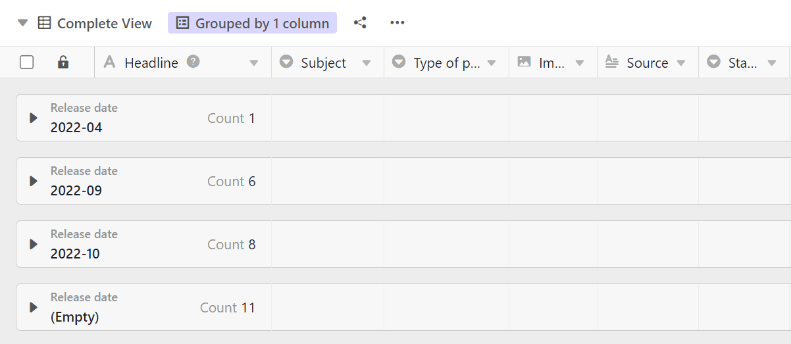

The grouping function allows you to combine table entries into **groupings** and calculate simple descriptive statistics such as the number of elements or totals and averages of number columns.

## Group entries in a view

1. Create a [new view]() or select the view in which you want to group.
2. Click the **Group** option in the view options above the table.
3. Go to **Add Grouping**.
4. In the empty field, select the **column** by which you want to group.
5. In the second field, decide whether the grouping should be listed in **ascending** or **descending** order.

## Group levels

You can **group** by adding further groupings **according to up to three criteria at the same time**. This creates multiple levels or subgroups within the groupings.



## The group header

Each group has a header in which both the criterion of the group and the number of entries within the group are listed.

In the case of **number columns**, you also have the option of displaying various relationships between the entries:

- Total
- Average
- Median
- Minimum
- Maximum
- No calculation

Click the **triangular drop-down icon** in front of the payment column headline to select the respective option.

## Reduce and expand the displayed records

Using the triangular **drop-down icon** on the left of the group header, you can **individually** reduce and expand the display of records in each individual group.

The **Reduce All** or **Expand All** options allow you to collapse and expand the display of records in all groups with one click.

### Reduce all

Here you will find the **Reduce All** option:

**Reduce** the display with the **All** option enabled:

### Expand all

Here you will find the **Expand All** option:

**Expand** the display with the **All** option enabled:

## Move entries to another group

You can assign individual entries to new groups by dragging and dropping them. The criterion on which the group is based is adjusted when the entry is moved.

## Ungroup

Of course, you can delete groupings at any time by clicking on the **x symbol** in front of the respective grouping.

