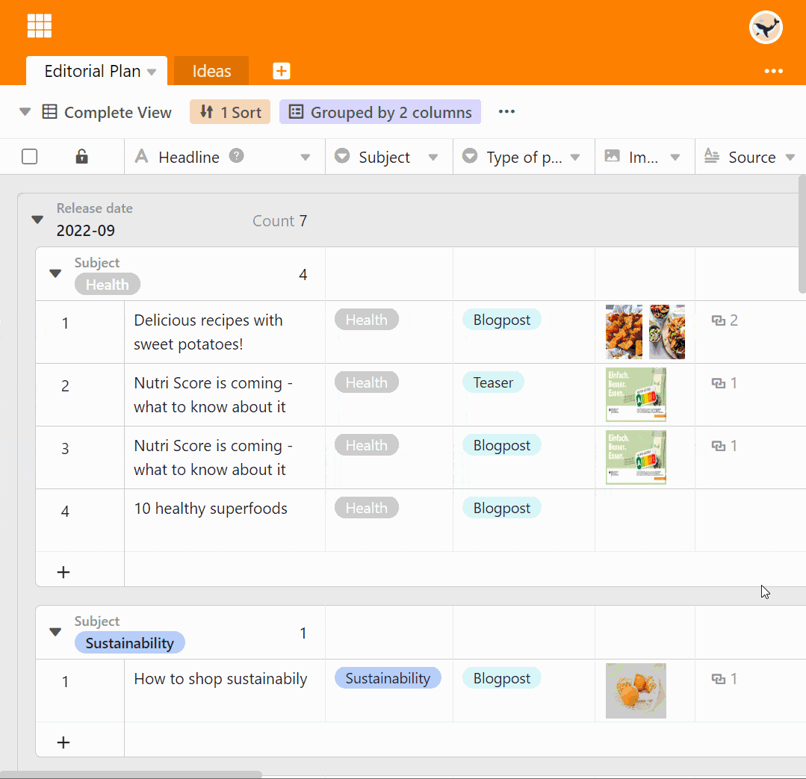

La fonction de regroupement permet de **regrouper** les entrées du tableau et d'obtenir des statistiques descriptives simples telles que le nombre d'éléments ou les totaux et moyennes des colonnes de chiffres.

## Regrouper des entrées dans une vue

1. Créez une [nouvelle vue]() ou sélectionnez la vue dans laquelle vous souhaitez effectuer le regroupement.
2. Dans les options d'affichage, cliquez sur l'option **Grouper** au-dessus du tableau.
3. Allez sur **Ajouter un regroupement**.
4. Dans le champ vide, sélectionnez la **colonne** selon laquelle vous souhaitez regrouper.
5. Décidez dans le deuxième champ si le regroupement doit être listé par **ordre croissant** ou **décroissant**.

## Niveaux de groupe

En ajoutant d'autres regroupements, vous pouvez **regrouper selon jusqu'à trois critères à la fois**. Cela permet de créer plusieurs niveaux ou sous-groupes au sein des regroupements.



## L'en-tête du groupe

Chaque groupe a un en-tête dans lequel sont mentionnés le critère du groupe ainsi que le nombre d'entrées au sein du groupe.

Pour les **colonnes de chiffres**, vous avez en outre la possibilité de représenter différentes relations entre les entrées :

- Total
- Moyenne
- Médiane
- Minimum
- Maximum
- Pas de calcul

Cliquez sur l'**icône triangulaire déroulante** devant l'en-tête de la colonne de paiement pour sélectionner l'option correspondante.

## Réduction et extension des enregistrements affichés

L'**icône** triangulaire **déroulante** à gauche de l'en-tête du groupe permet de réduire et d'élargir **individuellement** l'affichage des enregistrements dans chaque groupe individuel.

Les options **Réduire tout** ou **Développer** tout permettent de réduire et de déployer l'affichage des enregistrements dans tous les groupes en un seul clic.

### Réduire tout

Vous trouverez ici l'option **Réduire tout**:

**Réduire** l'affichage avec l'option **Tous** activée :

### Élargir tout

Vous trouverez ici l'option **Étendre tout**:

**Développer** l'affichage avec l'option **Tout** activée :

## Déplacer des entrées vers un autre groupe

Vous pouvez affecter des entrées individuelles à de nouveaux groupes en les faisant glisser et en les déposant. Dans ce cas, le critère sur lequel se base le groupe est adapté lors du déplacement de l'entrée.

## Annuler le regroupement

Vous pouvez bien sûr supprimer des regroupements à tout moment en cliquant sur le **symbole x** devant le regroupement concerné.

