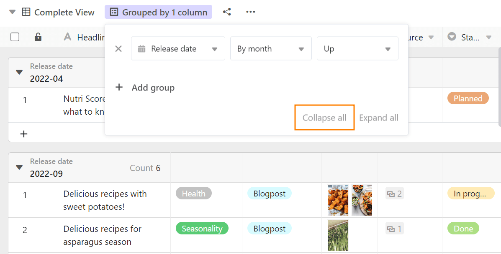
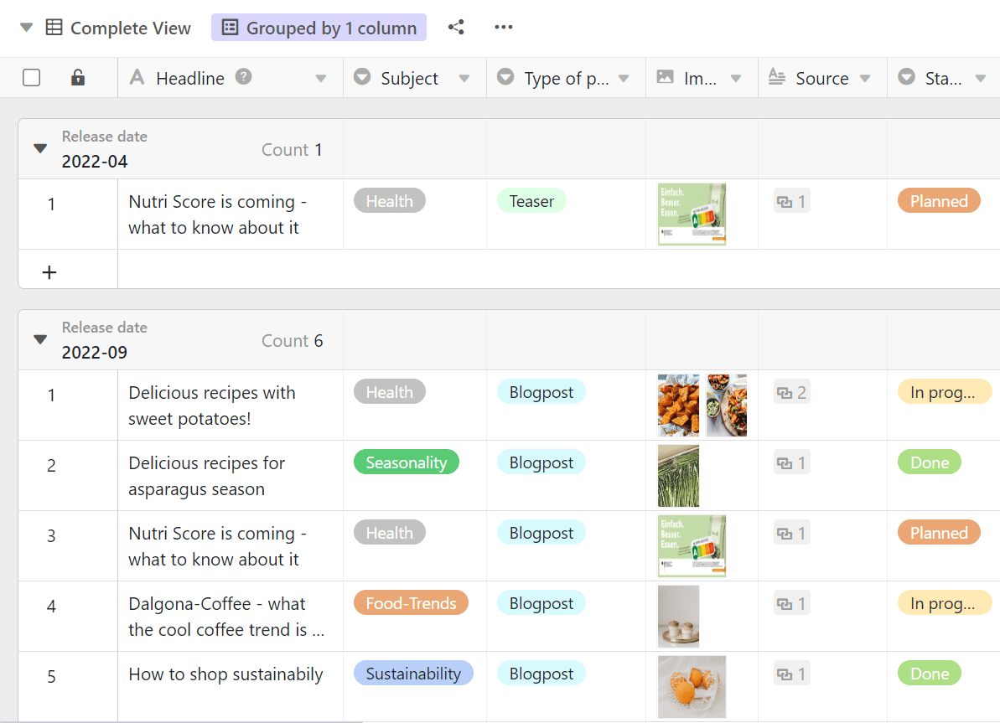

Com a função de agrupamento, é possível combinar as entradas da tabela em **agrupamentos** e determinar estatísticas descritivas simples tais como o número de elementos ou totais e valores médios das colunas de números. O agrupamento é efectuado utilizando **valores idênticos na coluna selecionada para o agrupamento**.

## Agrupar entradas numa vista

1. Crie uma [nova vista]() ou seleccione a vista em que pretende agrupar.
2. Clique na opção **Agrupar** nas opções de visualização acima da tabela.
3. Ir para **Adicionar Agrupamento**.
4. No campo vazio, seleccione a **coluna** pela qual pretende agrupar.
5. Decidir no segundo campo se o agrupamento deve ser listado em ordem **ascendente** ou **descendente**.



O agrupamento é efectuado **em tempo real**, ou seja, os registos de dados são agrupados antes de a janela ser fechada. Isto permite-lhe ver imediatamente se alcançou o resultado desejado e fazer quaisquer ajustes necessários.

## Agrupamentos aninhados

Pode **agrupar de acordo com até três critérios ao mesmo tempo**, acrescentando outros agrupamentos. Isto cria vários níveis ou subgrupos dentro dos agrupamentos.



## Personalize o agrupamento

Para personalizar o agrupamento, abra novamente a janela clicando no botão nas definições da vista. Tal como quando adicionou a regra de agrupamento, pode agora personalizar a regra. Também pode **alterar a hierarquia das regras de agrupamento**, mantendo premido o botão esquerdo do rato na área de aderência de seis pontos e arrastando a regra para a posição pretendida.

## Comportamento de agrupamento por tipo de coluna

SeaTable suporta o agrupamento por todos os [tipos de coluna]() exceto os tipos de coluna **Texto formatado, Ficheiro, Imagem, Número automático, Botão e Assinatura digital**.

O agrupamento baseia-se nos seguintes princípios de organização:

- Texto, E-mail, URL, Número de telefone: alfabético ou alfanumérico
- Número, Duração, Classificação: numérico
- Data, Criado, Última edição: cronológico
- Seleção única e múltipla: de acordo com a ordem das opções
- Colaborador, Criador, Último modificador: alfabético
- Caixa de verificação: dicotómica
- Fórmula: consoante o tipo de dados do resultado
- Ligação: consoante o tipo de dados da coluna referenciada

Todas as linhas **com células vazias na coluna de agrupamento** são resumidas na parte inferior da vista num grupo separado chamado (Vazio).

## O cabeçalho do grupo

Cada grupo tem um cabeçalho no qual tanto o critério do grupo como o número de entradas dentro do grupo são listados.

No caso de **colunas numéricas**, também tem a opção de exibir várias relações entre as entradas:

- Total
- Média
- Median
- Mínimo
- Máximo
- Nenhum cálculo

Clique no **ícone triangular** em frente ao título da coluna numérica para seleccionar a respectiva opção.

## Reduzir e expandir os registos apresentados

Usando o **ícone drop-down** triangular à esquerda no cabeçalho do grupo, pode reduzir e expandir **individualmente** a exibição de registos em cada grupo individual.

Ao utilizar as opções **Reduzir Tudo** ou **Expandir Tudo**, pode colapsar e expandir a exibição de registos em todos os grupos com um clique.

### Reduzir tudo

Aqui encontrará a opção **Reduzir Tudo**:

**Reduzir** a vista com a opção activada:

### Expandir tudo

Aqui encontrará a opção **Expandir tudo**:

**Expandir** a vista com a opção activada:

## Mover as entradas para outro grupo

Pode atribuir entradas individuais a novos grupos, arrastando e largando. O critério em que o grupo se baseia é ajustado quando a entrada é deslocada.

## Desagrupar

É claro que pode eliminar grupos em qualquer altura, clicando no **símbolo x** em frente do respectivo grupo.

