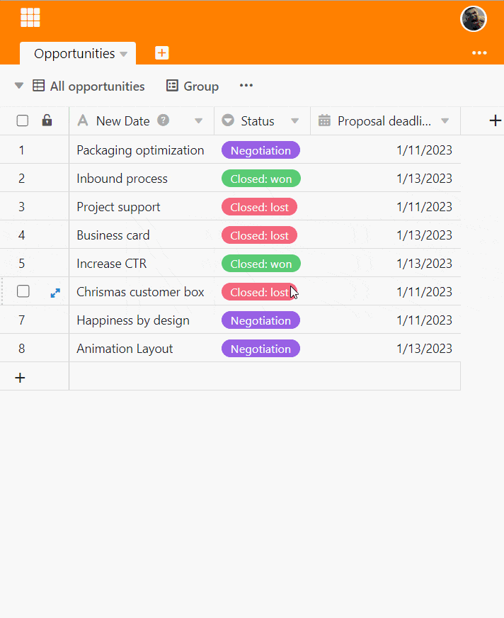
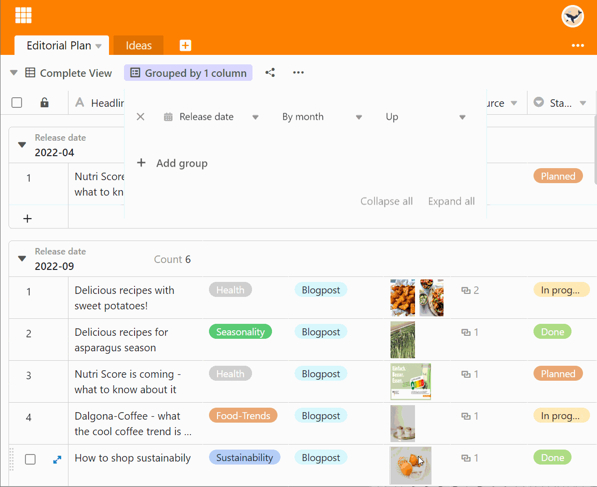
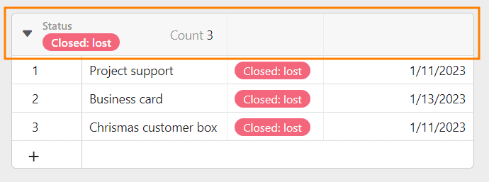
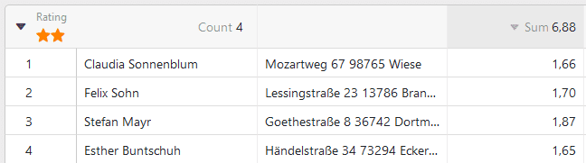
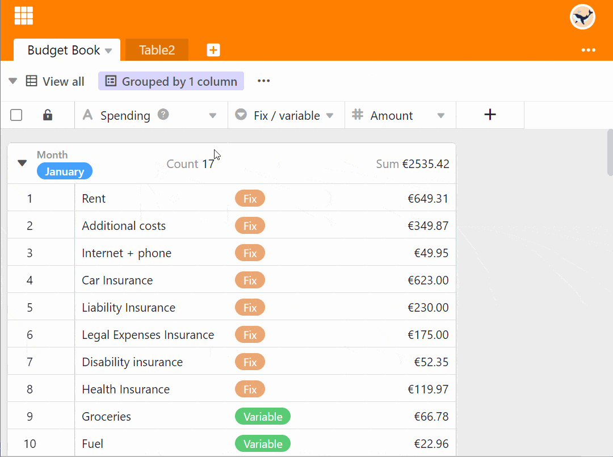
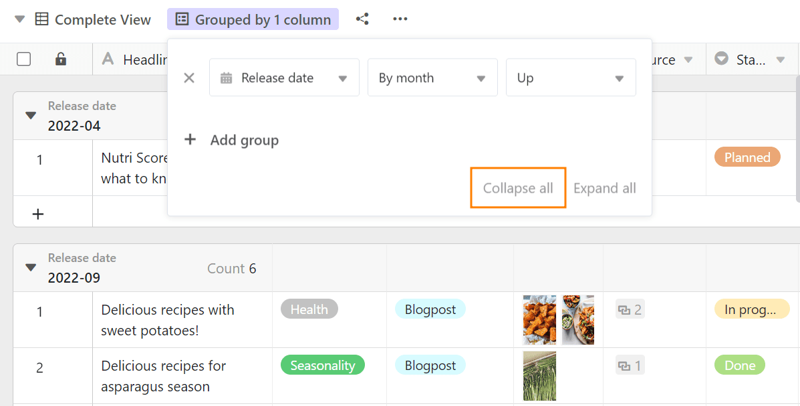
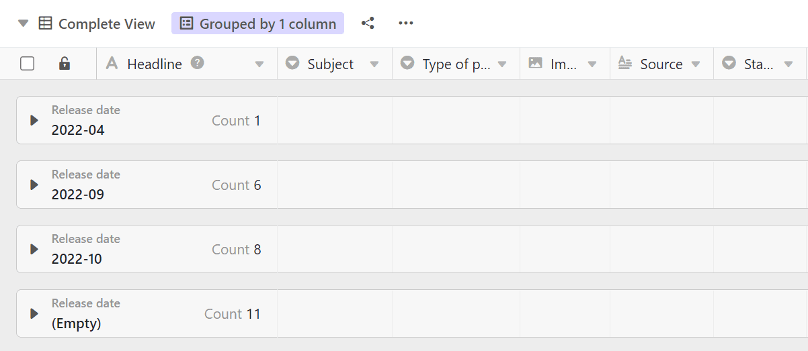
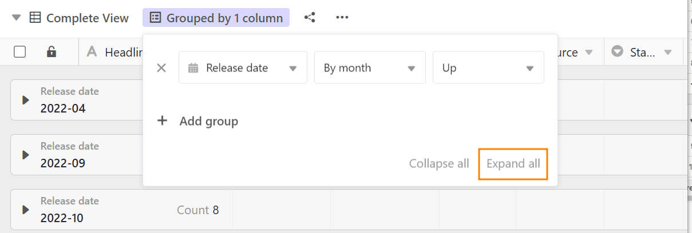
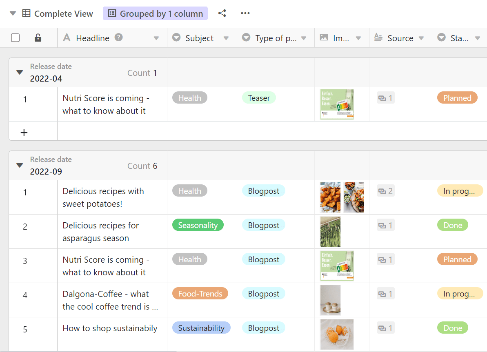
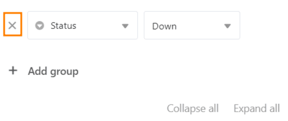

С помощью функции группировки можно объединить записи таблицы в **группы** и определить простые описательные статистики, такие как количество элементов или итоговые и средние значения числовых столбцов.

## Группировка записей в представлении

1. Создайте [новое представление]() или выберите представление, в котором вы хотите сгруппироваться.
2. Нажмите на опцию **Группа** в опциях просмотра над таблицей.
3. Перейдите в раздел **Добавить группировку**.
4. В пустом поле выберите **столбец**, по которому вы хотите сгруппировать.
5. Во втором поле определите, в каком порядке должна быть перечислена группировка - по **возрастанию** или по **убыванию**.

## Групповые уровни

Вы можете **группировать по трем критериям** одновременно, добавляя дополнительные группировки. Это создает несколько уровней или подгрупп внутри группировок.



## Заголовок группы

Каждая группа имеет заголовок, в котором указан критерий группы и количество записей в группе.

В случае с **колонками платежей** у вас также есть возможность отображать различные взаимосвязи между записями:

- Всего
- Среднее
- Медиана
- Минимум
- Максимальный
- Нет расчетов

Нажмите на **треугольный раскрывающийся значок** перед заголовком колонки платежей, чтобы выбрать соответствующий вариант.

## Уменьшение и увеличение отображаемых записей

Используя треугольный **раскрывающийся значок** слева в заголовке группы, вы можете **индивидуально** уменьшать и увеличивать отображение записей в каждой отдельной группе.

Используя опции **Уменьшить все** или **Развернуть все**, вы можете свернуть или развернуть отображение записей во всех группах одним щелчком мыши.

### Сократить все

Здесь вы найдете опцию **Уменьшить все**:

**Уменьшите** дисплей при активированной опции " **Все**":

### Развернуть все

Здесь вы найдете опцию **Развернуть все**:

**Разверните** дисплей с активированной опцией " **Все**":

## Переместить записи в другую группу

Вы можете назначать отдельные записи новым группам путем перетаскивания. Критерий, на котором основана группа, корректируется при перемещении записи.

## Разгруппировать

Конечно, вы можете удалить группировки в любое время, нажав на **символ x** перед соответствующей группировкой.

