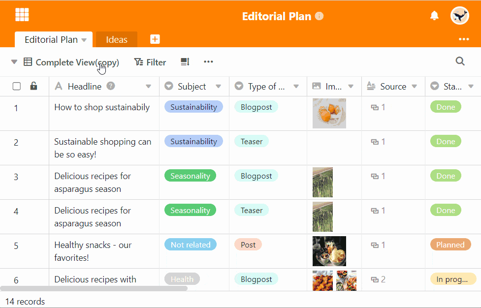

Vous pouvez supprimer à tout moment les vues créées de manière incorrecte ou devenues non pertinentes en cliquant sur le menu des vues et en sélectionnant l'option **Supprimer la vue**.

## Supprimer une vue

1. Cliquez sur le **nom de la vue actuelle**.
2. Passez la souris sur la vue que vous souhaitez supprimer.
3. **Trois points** sont visibles dans la ligne d'affichage. Sélectionnez-les.
4. Sélectionnez l'option **Supprimer la vue**.

## Questions fréquentes

**Non**. Étant donné qu'une vue ne contient pas de données propres, mais qu'il s'agit simplement d'une représentation spéciale des données, il n'est pas possible d'effacer une vue supprimée via la Corbeille ni via le raccourci  +  restaurer.

Vous ne pouvez supprimer des vues que si vous avez créé **au moins une vue supplémentaire** à la Default View.


