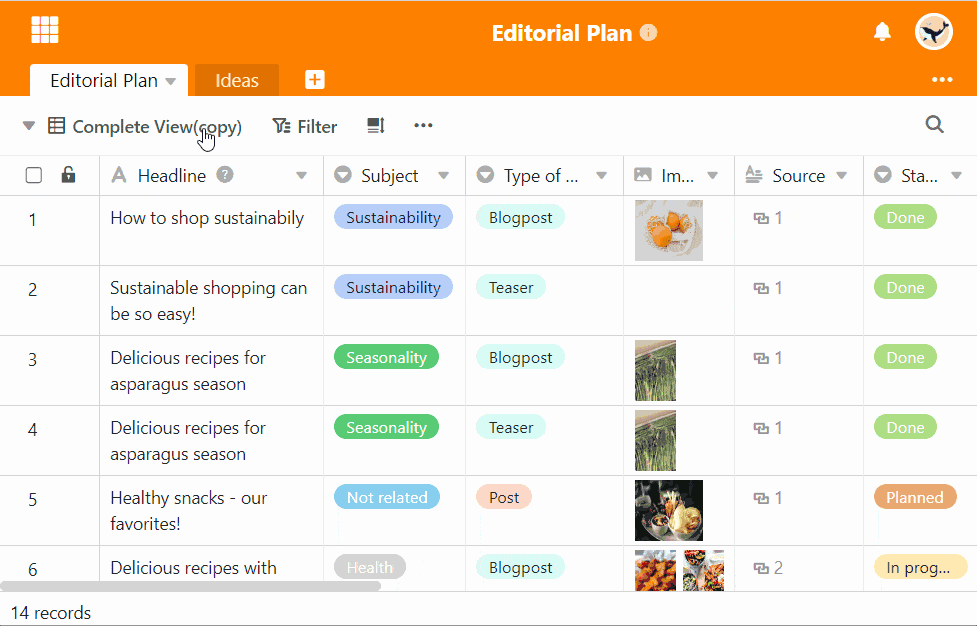

Pode apagar vistas que tenham sido criadas incorrectamente ou que se tenham tornado irrelevantes em qualquer altura, clicando no menu de visualização e seleccionando a opção **Apagar** Vista.

## Apagar uma vista

1. Clique sobre o **nome da vista actual**.
2. Mova o rato sobre a vista que pretende eliminar.
3. **Três pontos** tornam-se visíveis na linha de vista. Seleccione-os.
4. Seleccionar a opção **Eliminar Vista**.

## Perguntas mais frequentes



Uma vista eliminada pode ser restaurada?|||

**Não**. Uma vez que uma vista não contém quaisquer dados próprios, mas é apenas uma representação especial dos dados, uma vista apagada não pode ser apagada nem através do caixote da reciclagem nem através do atalho  +  Restaurar.

---

Uma vista pode ser sempre apagada?|||

Só pode eliminar vistas se tiver criado **pelo menos uma vista adicional** à vista padrão.


