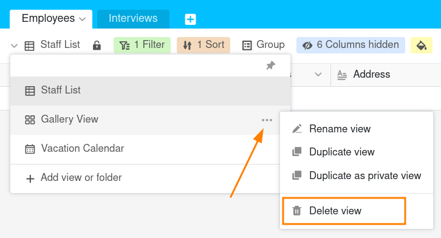

Вы можете в любой момент удалить тестовые представления или представления, ставшие неактуальными, выбрав опцию **Удалить представление**.

## Удалить представление

1. Щелкните по **названию текущего представления**.
2. Наведите курсор мыши на вид, который вы хотите удалить.
3. **Три точки** становятся видимыми на линии просмотра. Выберите их.
4. Выберите опцию **Удалить вид**.

## Часто задаваемые вопросы

**Нет**. Поскольку представление не содержит никаких собственных данных, а является лишь специальным представлением данных, удаленное представление нельзя восстановить ни через корзину, ни через ярлык +.


Удалять представления можно только в том случае, если вы создали **хотя бы одно дополнительное представление** к представлению по умолчанию.

