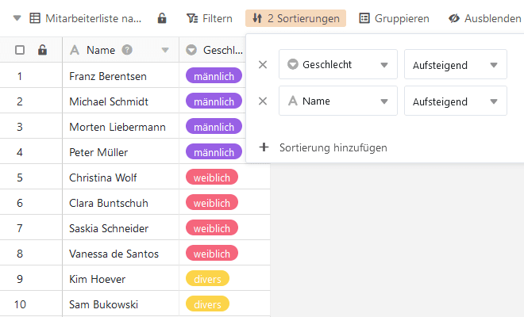

Mit der Sortierungsfunktion können Sie die ungeordneten Einträge in einer Tabelle **in einer geordneten Reihenfolge** anzeigen lassen.

## Einträge in einer Ansicht sortieren

1. Erstellen Sie eine [neue Ansicht]() oder wählen Sie die Ansicht aus, die Sie sortieren wollen.
2. Klicken Sie in den Ansichtsoptionen über der Tabelle die Option **Sortieren** an.
3. Gehen Sie auf **Sortierung hinzufügen**.
4. Wählen Sie im leeren Feld die **Spalte** aus, nach der Sie sortieren möchten.
5. Entscheiden Sie im zweiten Feld, ob die Datensätze **aufsteigend** oder **absteigend** aufgelistet werden sollen.

Für **mehrstufige Sortierungen** wiederholen Sie den Vorgang. Um **die Hierarchie der Sortierungsregeln zu ändern**, halten Sie die linke Maustaste auf der Sechs-Punkt-Greiffläche gedrückt und ziehen die Regel an die gewünschte Position.

Die Sortierung wird **in Echtzeit** durchgeführt, d.h. die Datensätze werden noch vor Schließen des Fensters sortiert. So können Sie unmittelbar sehen, ob Sie das gewünschte Ergebnis erzielt haben, und ggf. nachjustieren.

## Sortierungsverhalten nach Spaltentyp

SeaTable unterstützt Sortierungen nach allen [Spaltentypen]() mit Ausnahme der Spaltentypen **Formatierter Text, Datei, Bild, Geoposition, Ersteller, letzter Bearbeiter, Schaltfläche und digitale Signatur**.

Die Sortierung erfolgt nach folgenden Ordnungsprinzipien:

- Text, Mitarbeiter, E-Mail, URL, Telefonnummer: alphabetisch bzw. alphanumerisch
- Zahl, Dauer, Rating, automatische Nummer: numerisch
- Datum, Erstellt, Zuletzt bearbeitet: chronologisch
- Einfach- und Mehrfachauswahl: nach der Reihenfolge der Optionen
- Checkbox: dichotom
- Formel: je nach Datentyp des Ergebnisses
- Verknüpfung: je nach Datentyp der referenzierten Spalte

Alle Zeilen **mit leeren Zellen in der Sortierungsspalte** werden am unteren Ende der Ansicht angezeigt.

## Eine Sortierung entfernen

Sie können eine erstellte Sortierung löschen, indem Sie auf das **x-Symbol** klicken.

## Nachträgliches Hinzufügen von Zeilen

Eine aktivierte Sortierung wird automatisch auf neu hinzugefügte Zeilen angewendet.

## Mehrere Sortierungen anwenden

Indem Sie mehrere Sortierungen anwenden, können Sie Datensätze ordnen, die bei einer vorhergehenden Sortierung **den gleichen Eintrag** aufweisen. Zum Beispiel können Sie eine Mitarbeiterliste über eine Einfachauswahlspalte zunächst nach den Optionen "weiblich", "männlich", "divers" ordnen und dann über eine Textspalte die Namen der Frauen, Männer und Sonstigen jeweils alphabetisch sortieren.


