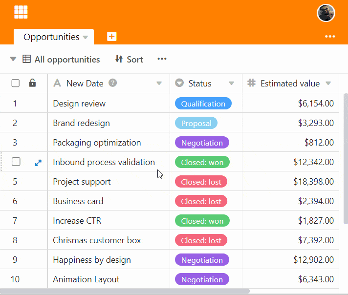
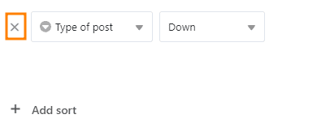
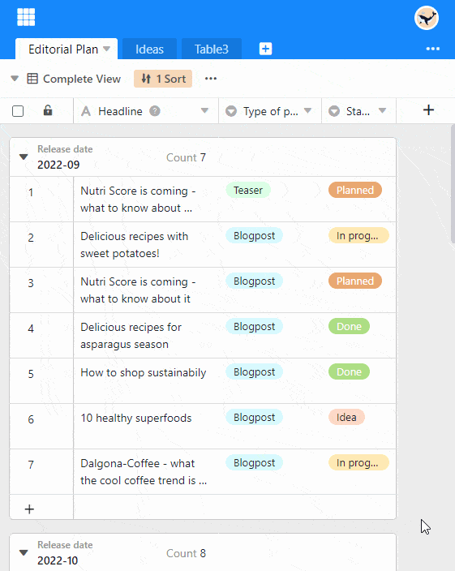
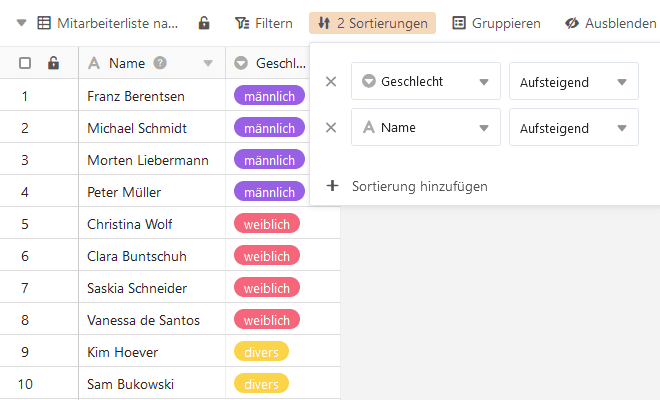

The sort function allows you to display the unordered entries in a table in an **ordered sequence**.

## Sort entries in a view

1. Create a [new view]() or select the view you want to sort.
2. Click the **Sort** option in the view options above the table.
3. Go to **Add sorting**.
4. In the empty field, select the **column** you want to sort by.
5. In the second field, decide whether the data should be listed in **ascending** or **descending** order.

## Sorting different types of data

Columns containing letter sequences, such as **text** or **email**, are sorted alphabetically, while columns containing digit sequences, such as **number**, **duration**, or **date,** are sorted numerically. Single and multiple selection columns are sorted by SeaTable according to the order of options you set in the corresponding column menu.

## Remove a sort

You can delete a created sort by clicking the **x icon**.

## Subsequent addition of rows

An activated sorting is automatically applied to newly added rows .

## Apply multiple sorts

By applying multiple sorts, you can order records that have the **same entry** in a previous sort. For example, you can first sort a list of employees by the options "female", "male", "miscellaneous" via a single selection column and then sort the names of the females, males and miscellaneous each alphabetically via a text column.


