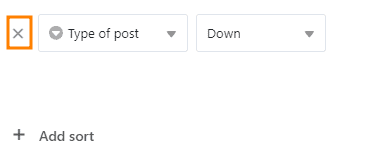

La función de ordenación permite mostrar las entradas no ordenadas de una tabla en una **secuencia ordenada**.

## Ordenar las entradas de una vista

1. Cree una [nueva vista]() o seleccione la vista que desea ordenar.
2. Haga clic en la opción **Ordenar** de las opciones de visualización situadas encima de la tabla.
3. Vaya a **Añadir orden**.
4. En el campo vacío, seleccione la **columna** por la que desea ordenar.
5. En el segundo campo, decida si los datos deben aparecer en orden **ascendente** o **descendente**.

Repita el proceso para la **ordenación multinivel**. Para **cambiar la jerarquía de las reglas de ordenación**, mantenga pulsado el botón izquierdo del ratón en la zona de agarre de seis puntos y arrastre la regla a la posición deseada.

La ordenación se realiza **en tiempo real**, es decir, los registros de datos se ordenan antes de que se cierre la ventana. Esto le permite ver inmediatamente si ha logrado el resultado deseado y realizar los ajustes necesarios.

## Comportamiento de la ordenación según el tipo de columna

SeaTable admite la ordenación por todos los [tipos de columna]() con la excepción de los tipos de columna **Texto con formato, Archivo, Imagen, Geoposición, Creador, Último modificador, Botón y Firma digital**.

La ordenación se basa en los siguientes principios de ordenación:

- Texto, Colaborador, Correo electrónico, URL, Número de teléfono: alfabético o alfanumérico
- Número, Duración, Calificación, número automático: numérico
- Fecha, Creación, Última modificación: cronológico
- Selección única y múltiple: según el orden de las opciones
- Casilla de verificación: dicotómica
- Fórmula: según el tipo de datos del resultado
- Enlace: según el tipo de datos de la columna referenciada

Todas las filas **con celdas vacías en la columna de ordenación** se muestran en la parte inferior de la vista.

## Eliminar una ordenación

Puede eliminar una ordenación creada haciendo clic en el **símbolo x**.

## Añadir filas a posteriori

La ordenación activada se aplica automáticamente a las filas recién añadidas.

## Aplicar varias ordenaciones

Al aplicar ordenaciones múltiples, puede ordenar registros que tengan la **misma entrada** en una ordenación anterior. Por ejemplo, puede ordenar primero una lista de empleados por las opciones "mujer", "hombre", "varios" utilizando una única columna de selección y, a continuación, ordenar alfabéticamente los nombres de las mujeres, los hombres y los varios utilizando una columna de texto.


