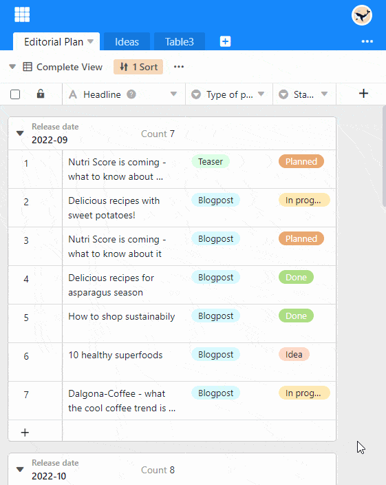

La fonction de tri vous permet d'afficher les entrées non classées d'un tableau dans un **ordre ordonné**.

## Trier les entrées d'une vue

1. Créez une [nouvelle vue]() ou sélectionnez la vue que vous souhaitez trier.
2. Dans les options de vue, cliquez sur l'option **Trier** au-dessus du tableau.
3. Allez sur **Ajouter un tri**.
4. Dans le champ vide, sélectionnez la **colonne** selon laquelle vous souhaitez trier.
5. Dans le deuxième champ, décidez si les données doivent être listées dans l'ordre **croissant** ou **décroissant**.

Pour les **triages multi-niveaux**, répétez la procédure. Pour **modifier la hiérarchie des règles de tri**, maintenez le bouton gauche de la souris enfoncé sur la zone de préhension à six points et faites glisser la règle vers la position souhaitée.

Le tri est effectué **en temps réel**, ce qui signifie que les enregistrements sont triés avant même la fermeture de la fenêtre. Vous pouvez ainsi voir immédiatement si vous avez obtenu le résultat souhaité et procéder à des ajustements si nécessaire.

## Comportement de tri par type de colonne

SeaTable prend en charge le tri sur tous les [types de colonnes]() à l'exception des types de colonnes **Texte formaté, Fichier, Image, Géoposition, Créateur, Dernier modificateur, Bouton et Signature numérique**.

Le tri est effectué selon les principes d'ordre suivants :

- Texte, Collaborateur, E-mail, URL, Numéro de téléphone : alphabétique ou alphanumérique
- Nombre, Durée, Classement, Numéro automatique : numérique
- Date, Création, Dernière modification : par ordre chronologique
- Sélection unique ou multiple : selon l'ordre des options
- Case à cocher : dichotomique
- Formule : selon le type de données du résultat
- Lien : selon le type de données de la colonne référencée

Toutes les lignes **avec des cellules vides dans la colonne de tri** sont affichées en bas de la vue.

## Supprimer un tri

Vous pouvez supprimer un tri créé en cliquant sur l'**icône x**.

## Ajouter des lignes ultérieurement

Un tri activé est automatiquement appliqué aux nouvelles lignes ajoutées.

## Appliquer plusieurs tris

En appliquant plusieurs tris, vous pouvez classer des enregistrements qui présentent **la même entrée** lors d'un tri précédent. Par exemple, vous pouvez utiliser une colonne de sélection simple pour classer une liste d'employés selon les options "femmes", "hommes", "divers", puis utiliser une colonne de texte pour trier les noms des femmes, des hommes et des autres par ordre alphabétique.


