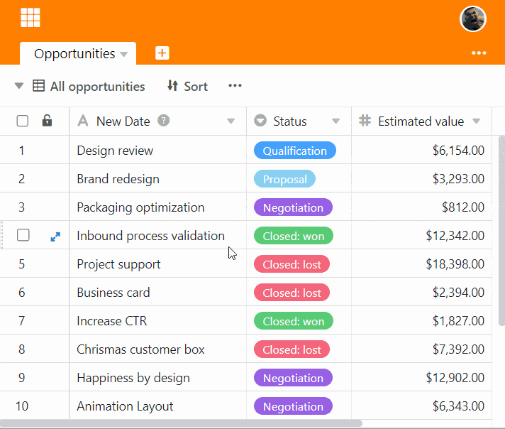

Функция сортировки позволяет отображать неупорядоченные записи в таблице в **упорядоченной последовательности**.

## Сортировка записей в представлении

1. Создайте [новое представление]() или выберите представление, которое нужно отсортировать.
2. Щелкните опцию **Сортировка** в опциях просмотра над таблицей.
3. Перейдите в раздел **Добавить порядок сортировки**.
4. В пустом поле выберите **столбец**, по которому вы хотите отсортировать.
5. Во втором поле определите, в каком порядке должны быть перечислены данные - по **возрастанию** или по **убыванию**.

## Сортировка различных типов данных

Колонки, содержащие буквенные последовательности, такие как **текст** или **электронная почта**, сортируются по алфавиту, а колонки, содержащие числовые последовательности, такие как **число**, **длительность** или **дата,** сортируются по цифрам. Столбцы с одиночным и множественным выбором сортируются SeaTable в соответствии с порядком опций, которые вы установили в меню соответствующего столбца.

## Удалить сортировку

Вы можете удалить созданную сортировку, нажав на **символ x**.

## Добавление строк после

Активированная сортировка автоматически применяется к вновь добавленным строкам.

## Применяйте несколько сортов

Применяя несколько сортировок, можно упорядочить записи, которые имеют **одинаковые записи** в предыдущей сортировке. Например, можно сначала отсортировать список сотрудников по параметрам "женщины", "мужчины", "разное" с помощью одного столбца выбора, а затем отсортировать имена женщин, мужчин и разное в алфавитном порядке с помощью текстового столбца.


