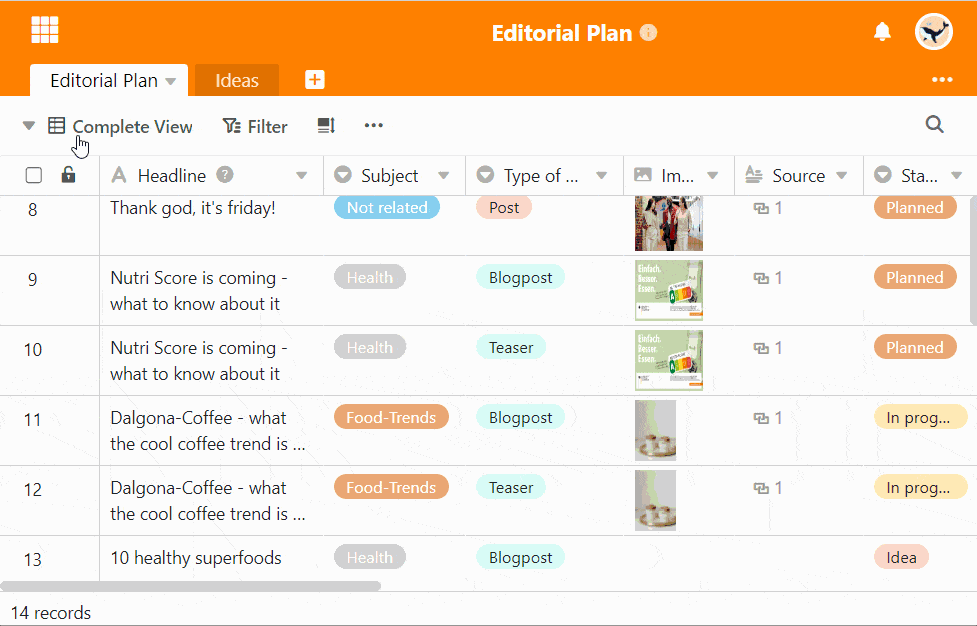

Für den optimalen Überblick über die Daten in Ihrer Tabelle bietet SeaTable Ihnen **Ansichten**, in denen Sie Ihre Filter, Sortierungen und Gruppierungen speichern können. Diesen Ansichten sollten Sie einen aussagekräftigen Namen geben. Auch nachträglich können Sie jederzeit Ihre **Ansichten umbenennen**.

## Ansichten umbenennen

1. Klicken Sie auf den **Namen der aktuellen Ansicht**.
2. Fahren Sie mit der Maus über die Ansicht, die Sie umbenennen möchten.
3. In der Ansichtszeile werden **drei Punkte** sichtbar. Wählen Sie diese aus.
4. Wählen Sie die Option **Ansicht umbenennen** aus.
5. Löschen Sie den alten Namen und geben Sie einen **neuen Namen** ein.

