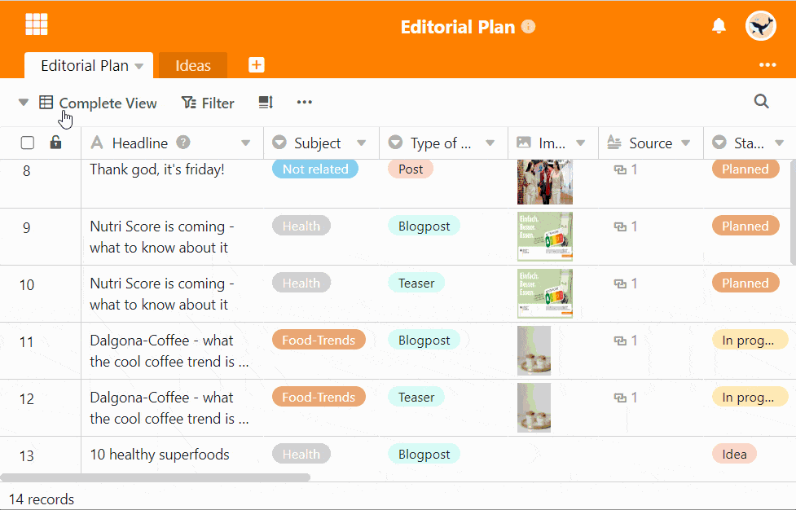

Para uma visão optimizada dos dados na sua tabela, SeaTable oferece-lhe **vistas** nas quais pode guardar os seus filtros, ordenações e agrupamentos. Deve dar um nome significativo a estes pontos de vista. Pode também **renomear** as suas opiniões em qualquer altura mais tarde.

## Renomear pontos de vista

1. Clique sobre o **nome da vista actual**.
2. Mova o rato sobre a vista que pretende renomear.
3. **Três pontos** tornam-se visíveis na linha de vista. Seleccione-os.
4. Seleccionar a opção **Renomear Vista**.
5. Apagar o nome antigo e introduzir um **novo nome**.

