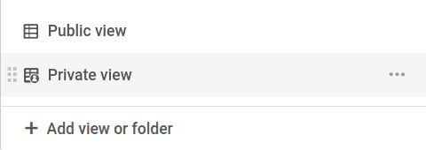



Dans SeaTable, il est possible de créer des vues normales et privées des tableaux. Comme leur nom l'indique, les vues privées ne sont visibles que par leur créateur et ne peuvent pas être partagées avec d'autres personnes. En dehors de cela, les vues privées ne sont pas différentes des vues normales.

## Analyse de données personnelles avec vues privées

Une vue dans SeaTable est la somme de nombreux paramètres, dont **filtres, tris, regroupements, surlignage en couleur et hauteur de ligne**. En d'autres termes, chaque vue offre un point de vue individuel sur les données de votre tableau.

La particularité des vues privées est qu'elles ne sont **pas visibles pour les autres utilisateurs**. Seul l'utilisateur qui a créé la vue privée peut la voir.

Comme les modifications apportées aux paramètres dans une vue privée n'ont pas d'effet sur les autres utilisateurs, elles sont particulièrement adaptées à votre **analyse personnelle des données**, dans laquelle vous souhaitez modifier les paramètres à votre guise.

## Les vues privées ne peuvent pas être partagées

Une autre différence entre les vues normales et privées réside dans le fait que les vues privées ne peuvent pas être partagées avec d'autres personnes. L'icône correspondante pour partager cette vue n'est pas disponible.

## Créer une vue privée

1. Cliquez sur le **nom de la vue actuelle**.
2. Cliquez sur **Ajouter une vue ou un dossier** et choisissez le **type de vue** souhaité.
3. Donnez un **nom** à la nouvelle vue.

4. Activez le curseur indiquant que la nouvelle vue doit être **privée**.
5. Confirmez en cliquant sur **Envoyer**.

## Dupliquer des vues normales en tant que vues privées

Si vous souhaitez personnaliser une vue normale visible par d'autres, il vous suffit de la dupliquer en tant que vue privée. La vue originale reste alors inchangée.

## Convertir les vues privées en vues normales

D'autre part, vous pouvez également transformer vos vues privées en vues normales non privées, visibles par d'autres personnes. La vue n'est toutefois pas dupliquée, de sorte qu'elle n'existe plus en tant que vue privée, mais uniquement en tant que vue normale.

