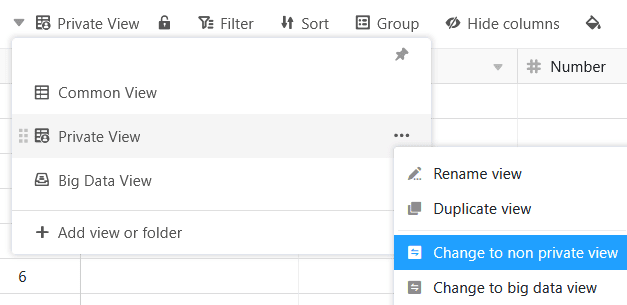



No SeaTable é possível criar tanto vistas normais como privadas. As vistas privadas são, como o nome sugere, apenas visíveis para o respectivo criador e não podem ser partilhadas com outras pessoas. Caso contrário, as vistas privadas não diferem das vistas normais.

## Análise de dados pessoais com vistas privadas

Uma vista no SeaTable é a soma de muitas definições, incluindo **filtros, ordenação, agrupamento, realce de cores e altura da linha**. Por outras palavras, cada vista oferece uma perspetiva individual sobre os dados da sua tabela.

A caraterística especial das vistas privadas é que **não** são **visíveis para os outros utilizadores**. Apenas o utilizador que criou a vista privada a pode ver.

Uma vez que as alterações às definições numa vista privada não têm efeito sobre os outros utilizadores, são particularmente adequadas para as suas **análises de dados pessoais**, em que pretende alterar as definições de acordo com os seus desejos.

## As vistas privadas não podem ser partilhadas

Outra diferença entre as vistas normais e privadas é que as vistas privadas não podem ser partilhadas com outras pessoas. O ícone correspondente para partilhar esta vista não está disponível.

## Criar uma vista privada

1. Clique no **Nome da vista atual**.
2. Clique em **Adicionar vista ou pasta** e selecione o **Tipo de vista** pretendido.
3. Atribua um **nome** à nova vista.

4. Ativar o cursor para tornar a nova vista **privada**.
5. Confirme com **Submeter**.

## Duplicar vistas normais como vistas privadas

Se quiser personalizar uma vista normal que é visível para os outros, pode simplesmente duplicá-la como uma vista privada. A vista original mantém-se inalterada.

## Converter vistas privadas em vistas normais

Por outro lado, também pode converter as suas vistas privadas em vistas normais não privadas, que são visíveis para os outros. No entanto, isto não duplica a vista de modo a que esta deixe de estar disponível como vista privada, mas apenas como vista normal.

