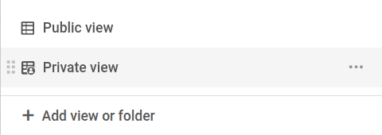
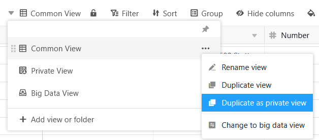
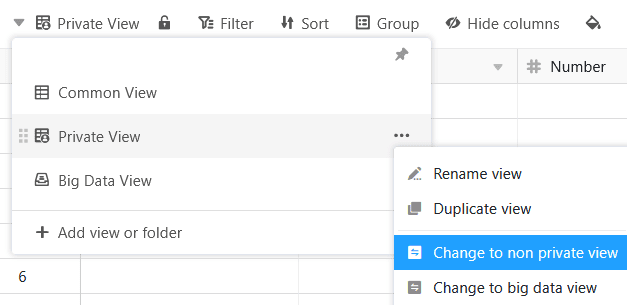



В SeaTable можно создавать как обычные, так и частные представления таблиц. Приватные просмотры, как следует из названия, видны только их создателю и не могут быть доступны другим людям. В остальном частные взгляды не отличаются от обычных.

## Анализ персональных данных с закрытыми представлениями

Представление в SeaTable - это совокупность следующих настроек: [Фильтры](). Другими словами, каждое представление предлагает индивидуальный взгляд на данные в таблице.

Особенностью частных представлений является то, что они **не видны другим пользователям**. Только пользователь, создавший частное представление, может его видеть.

Поскольку изменения настроек в приватном просмотре не имеют последствий для других пользователей, они особенно удобны для **анализа** ваших **персональных данных**, когда вы хотите изменить настройки в соответствии со своими пожеланиями.

## Частные взгляды не могут быть общими

Еще одно различие между обычными и частными взглядами заключается в том, что частными взглядами нельзя делиться с другими людьми. Соответствующий значок для совместного использования этого вида недоступен.

## Дублирование обычных представлений в качестве частных представлений

Если вы хотите настроить обычный вид, который виден другим пользователям, вы можете просто продублировать его как частный вид. При этом исходный вид остается неизменным.

## Преобразование частных представлений в обычные

С другой стороны, можно преобразовать приватные представления в неприватные, обычные представления, которые видны другим. Однако при этом вид не дублируется, и он больше не доступен как частный, а только как обычный.

