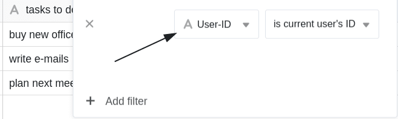
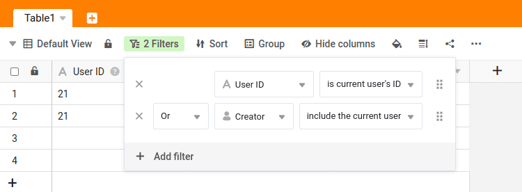

Die ID des Users lässt sich am besten mit einer **persönlichen Identifikationsnummer** beschreiben. Die ID des Users ist einzigartig innerhalb des Teams und gehört immer zu einem Teammitglied.

Mithilfe der User-ID kann man in SeaTable **dynamische Filter** setzen, welche in gewissen Situationen besser geeignet ist als ein Filter nach der [Ersteller-Spalte](https://seatable.io/docs/datum-dauer-und-personen/die-spalten-ersteller-und-erstellt/). In diesem Artikel stellen wir Ihnen die Vor- und Nachteile von Filtern mit der User-ID vor.

Wenn Sie wissen wollen, wie Sie die User-ID eines Teammitglieds ändern, [finden Sie in diesem Hilfeartikel die Antwort](https://seatable.io/docs/teamverwaltung-abonnement/aenderung-der-id-des-users-in-der-teamverwaltung/).



## Mit der User-ID filtern

In SeaTable können Sie für jede Text-Spalte den Filter **„is current user’s ID“** verwenden. Dies erzeugt einen **dynamischen Filter**, der ausschließlich Einträge anzeigt, bei dem in der entsprechenden [Text-Spalte](https://seatable.io/docs/text-und-zahlen/die-spalten-text-und-formatierter-text/) die **eigene User-ID** gespeichert ist.

### Anwendungsbeispiel

Angenommen Sie haben **drei Mitarbeiter** und diese haben folgende **IDs**:

- Markus mit der ID **20**
- Helmut mit der ID **23**
- Sven mit der ID **56**

Wenn Sie nun beispielsweise eine Tabelle pflegen, in die Sie die offenen Aufgaben Ihrer drei Mitarbeiter eintragen und einen solchen **Filter** definieren, ...

... wird ...

-  ... Markus **ausschließlich** die Einträge sehen, bei denen seine individuelle **User-ID 20** in der entsprechenden Spalte eingetragen ist.
  -  ... Helmut **ausschließlich** die Einträge sehen, bei denen seine individuelle **User-ID 23** in der entsprechenden Spalte eingetragen ist.
-  ... Sven **ausschließlich** die Einträge sehen, bei denen seine individuelle **User-ID 56** in der entsprechenden Spalte eingetragen ist.

## Wann ist ein solcher Filter sinnvoll?

Die Alternative wäre das Filtern nach der Spalte [Ersteller](), die ebenfalls dynamische Filtermöglichkeiten anbieten. Diese beiden Spalten haben jedoch die folgenden Nachteile:

- Der **Wert in der Ersteller-Spalte** lässt sich nachträglich _nicht_ mehr **ändern**. Einmal gesetzt, bleibt der Wert immer gleich. Dies wäre im oben genannten Beispiel problematisch, da der Ersteller der Aufgaben _nicht_ der Mitarbeiter ist.
- Die **Mitarbeiter-Spalte** lässt sich nur füllen, wenn ein Teammitglied mindestens **Lesezugriff** auf die Base hat. Insbesondere beim Einsatz der [Universellen App](https://seatable.io/docs/apps/universelle-app/) ist dies vielleicht _nicht_ gewünscht.
- Die Mitarbeiter-Spalte lässt sich _nicht_ **automatisch per Webformular füllen**. Die ID des Users kann hingegen per Zuweisung von _{creator.id}_ als Standard-Wert gesetzt werden.

Die in der Text-Spalte eingetragene **User-ID** können Sie jederzeit anpassen. Wenn Sie also die Zuweisung einer Zeile **nachträglich** verändern wollen, ist das Filtern nach der User-ID sehr hilfreich.

### Beispiel: Zuweisung von Aufgaben

Stellen Sie sich eine To-do-Liste vor, mit der Sie Aufgaben in SeaTable erfassen. Die **Ersteller-Spalte** kommt für die Zuweisung des Verantwortlichen _nicht_ in Frage, weil die Teammitglieder dann nur selbst Aufgaben anlegen und sich zuweisen könnten. Die **Mitarbeiter-Spalte** ist die naheliegendste Lösung, aber eben nur, wenn alle Teammitglieder mindestens Lesezugriff auf die Base haben. Wenn die Mitarbeiter auf keinen Fall die Aufgaben ihrer Kollegen sehen sollen, empfiehlt sich der Einsatz der User-ID zur Zuweisung des Verantwortlichen.

Wenn Sie die offene Aufgabe _"plan next meeting"_ von _Markus_ einem anderen Mitarbeiter zuweisen, also die **ID des Users** in dieser Zeile zum Beispiel von _20 (Markus)_ auf _23 (Helmut)_ ändern, wird die entsprechende Zeile automatisch aus der Tabellenansicht von Markus **herausgefiltert** und der Tabellenansicht von Helmut hinzugefügt.

Falls die Aufgabe nicht nur dem User mit der entsprechenden ID, sondern auch dem Ersteller der Zeile angezeigt werden soll, können Sie **zwei Filterregeln** mit einer [Entweder-Oder-Verknüpfung](https://seatable.io/docs/ansichtsoptionen/filter-regeln-mit-und-und-oder-verknuepfen/) setzen.

## ID des Users in Webformularen

In [Webformularen]() können Sie die **Identität der eingeloggten User** automatisch erfassen. Legen Sie dazu **{creator.id}** bzw. **{creator.name}** in den Seiteneinstellungen Ihres Webformulars als **Standardwert** fest und aktivieren Sie die Option, dass dieser _nicht_ geändert werden kann. Haben Sie diese Einstellungen getätigt, wird die **ID des eingeloggten Users** im Webformular **automatisch** eingesetzt und kann nicht mehr manuell eingetragen oder geändert werden.

