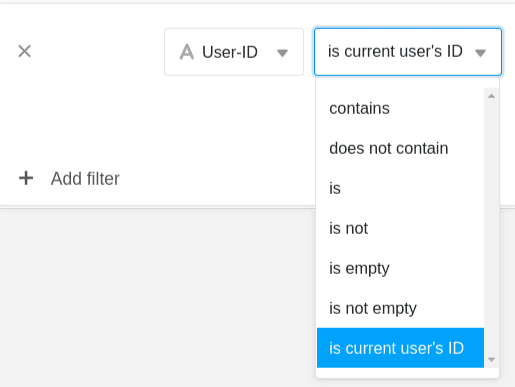
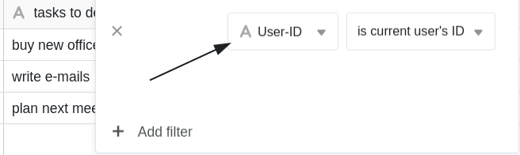
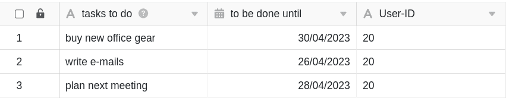
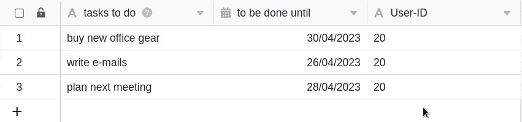
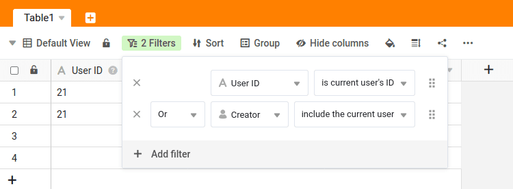
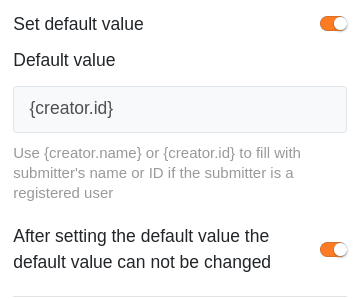

El ID de usuario se describe mejor como un **número de identificación personal**. El ID de usuario es único dentro del equipo y siempre pertenece a un miembro del equipo.

Con la ayuda del ID de usuario, puede establecer **filtros dinámicos** en SeaTable, que en determinadas situaciones son más adecuados que un filtro según la [columna del creador](https://seatable.io/es/docs/datum-dauer-und-personen/die-spalten-ersteller-und-erstellt/). En este artículo presentamos las ventajas y desventajas de los filtros con el ID de usuario.

Si quieres saber cómo cambiar el ID de usuario de un miembro del equipo, [encontrarás la respuesta en este artículo de ayuda](https://seatable.io/es/docs/teamverwaltung-abonnement/aenderung-der-id-des-users-in-der-teamverwaltung/).



## Filtro con el ID de usuario

En SeaTable puede utilizar el filtro **"es el ID del usuario actual"** para cada columna de texto. Esto crea un **filtro dinámico** que sólo muestra las entradas en las que el **propio ID** del usuario está almacenado en la [columna](https://seatable.io/es/docs/text-und-zahlen/die-spalten-text-und-formatierter-text/) de texto correspondiente.

### Ejemplo de aplicación

Suponga que tiene **tres empleados** y que tienen los siguientes **identificadores**:

- Markus con el ID **20**
- Helmut con el ID **23**
- Sven con el DNI **56**

Por ejemplo, si ahora mantiene una tabla en la que introduce las tareas pendientes de sus tres empleados y define un **filtro** de este tipo, ...

... se ...

-  ... Markus **sólo** verá las entradas para las que se haya introducido su **ID de usuario** individual **20** en la columna correspondiente.

-  ... Helmut **sólo** verá las entradas en las que se haya introducido su **ID de usuario** individual **23** en la columna correspondiente.
-  ... Sven **sólo** verá las entradas en las que se haya introducido su **ID de usuario** individual **56** en la columna correspondiente.

## ¿Cuándo tiene sentido un filtro de este tipo?

La alternativa sería filtrar por la columna [Creador](), que también ofrecen opciones de filtrado dinámico. Sin embargo, estas dos columnas presentan las siguientes desventajas:

- El valor de **la columna del creador** _no puede_ **modificarse** posteriormente. Una vez establecido, el valor siempre es el mismo. Esto sería problemático en el ejemplo anterior porque el creador de las tareas _no_ es el empleado.
- La **columna de personal** sólo puede rellenarse si un miembro del equipo tiene al menos **acceso de lectura** a la base. Esto puede _no_ ser deseable, especialmente cuando se utiliza la [aplicación universal](https://seatable.io/es/docs/apps/universelle-app/).
- La columna de personal _no_ se puede **rellenar automáticamente a través del formulario web**. El ID del usuario, sin embargo, puede establecerse como valor por defecto asignando _{creator.id}_.

Puede ajustar el ID de **usuario** introducido en la columna de texto en cualquier momento. Por lo tanto, si **posteriormente** desea cambiar la asignación de una fila, filtrar por el ID de usuario resulta muy útil.

### Ejemplo: Asignación de tareas

Imagine una lista de tareas con la que se introducen tareas en SeaTable. La columna del **creador** está _descartada_ para asignar al responsable, porque entonces los miembros del equipo sólo podrían crear tareas ellos mismos y asignárselas a sí mismos. La columna **staff** es la solución más obvia, pero sólo si todos los miembros del equipo tienen al menos acceso de lectura a la base. Si los miembros del equipo no deben ver las tareas de sus colegas bajo ninguna circunstancia, se recomienda utilizar el ID de usuario para asignar al responsable.

Si asigna la tarea abierta _"planificar la próxima reunión"_ de _Markus_ a otro miembro del personal, es decir, cambia el **ID del usuario** de esta fila de _20 (Markus_ ) a _23 (Helmut_ ), por ejemplo, la fila correspondiente se **filtra** automáticamente de la vista de tabla de Markus y se añade a la vista de tabla de Helmut.

Si la tarea debe mostrarse no sólo al usuario con el ID correspondiente, sino también al creador de la fila, puede establecer **dos reglas de filtrado** con un [enlace "o" o "o"](https://seatable.io/es/docs/ansichtsoptionen/filter-regeln-mit-und-und-oder-verknuepfen/).

## ID del usuario en formularios web

En los [formularios web](), puede registrar automáticamente la **identidad de los usuarios registrados**. Para ello, establezca **{creator.id}** o **{creator.name}** en la configuración de página de su formulario web como **valor predeterminado** y active la opción de que _no se pueda_ modificar. Una vez realizada esta configuración, el **ID del usuario conectado** se utilizará **automáticamente** en el formulario web y ya no podrá introducirse ni modificarse manualmente.

