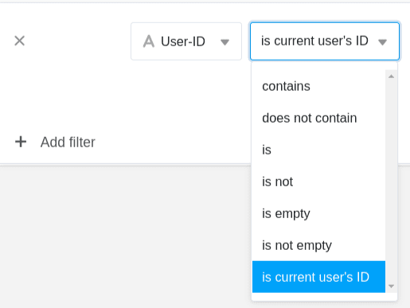

O ID de utilizador é melhor descrito como um **número de identificação pessoal**. O ID de utilizador é único dentro da equipa e pertence sempre a um membro da equipa.

Com a ajuda do ID do utilizador, é possível definir **filtros dinâmicos** no SeaTable, que em determinadas situações são mais adequados do que um filtro de acordo com a [coluna do criador](). Neste artigo, apresentamos as vantagens e desvantagens dos filtros com o ID do utilizador.

Se quiser saber como alterar o ID de utilizador de um membro da equipa, [encontrará a resposta neste artigo de ajuda]().



## Filtrar com o ID do utilizador

No SeaTable, pode utilizar o filtro **"é o ID do utilizador actual"** para cada coluna de texto. Isto cria um **filtro dinâmico** que apenas apresenta entradas em que o **ID do próprio utilizador** está armazenado na [coluna de texto]() correspondente.

### Exemplo de aplicação

Suponha que tem **três empregados** e que estes têm os seguintes **IDs**:

- Markus com o ID **20**
- Helmut com o BI **23**
- Sven com o BI **56**

Por exemplo, se se actualizar uma tabela na qual se entram as tarefas em aberto dos três empregados e se definir um **filtro** deste tipo, ...

... vai ...

-  ... Markus **só** verá as entradas para as quais o seu **ID de utilizador** individual **20** foi introduzido na coluna correspondente.

-  ... Helmut **só** verá as entradas em que o seu **ID de utilizador** individual **23** foi introduzido na coluna correspondente.
-  ... Sven **só** verá as entradas em que o seu **ID de utilizador** individual **56** é introduzido na coluna correspondente.

## Quando é que um filtro deste tipo faz sentido?

A alternativa seria filtrar pela coluna [Creator](), que também oferecem opções de filtragem dinâmica. No entanto, estas duas colunas têm as seguintes desvantagens:

- O **valor na coluna do criador** _não pode_ ser **alterado** posteriormente. Uma vez definido, o valor permanece sempre o mesmo. Isto seria problemático no exemplo acima porque o criador das tarefas _não_ é o empregado.
- A **coluna do pessoal** só pode ser preenchida se um membro da equipa tiver, pelo menos, **acesso de leitura** à base. Isto pode _não_ ser desejável, especialmente quando se utiliza a [aplicação universal]().
- A coluna do pessoal _não pode_ ser **preenchida automaticamente através do formulário Web**. No entanto, o ID do utilizador pode ser definido como o valor predefinido atribuindo _{creator.id}_.

É possível ajustar o **ID do utilizador** introduzido na coluna de texto em qualquer altura. Assim, se pretender alterar **posteriormente** a atribuição de uma linha, a filtragem pelo ID do utilizador é muito útil.

### Exemplo: Atribuição de tarefas

Imagine uma lista de afazeres com a qual introduz tarefas no SeaTable. A **coluna do criador** está _fora de_ questão para atribuir a pessoa responsável, porque os membros da equipa só poderiam criar tarefas e atribuí-las a si próprios. A **coluna do pessoal** é a solução mais óbvia, mas apenas se todos os membros da equipa tiverem, pelo menos, acesso de leitura à base. Se os membros da equipa não puderem ver as tarefas dos seus colegas em circunstância alguma, recomenda-se a utilização do ID de utilizador para atribuir a pessoa responsável.

Se atribuir a tarefa aberta _"planear a próxima reunião"_ de _Markus_ a outro membro da equipa, ou seja, se alterar o **ID do utilizador** nesta linha de _20 (Markus)_ para _23 (Helmut_ ), por exemplo, a linha correspondente é automaticamente **filtrada da** vista de tabela de Markus e adicionada à vista de tabela de Helmut.

Se a tarefa tiver de ser apresentada não só ao utilizador com o ID correspondente, mas também ao criador da linha, é possível definir **duas regras de** filtragem com uma [ligação ou-ou]().

## ID do utilizador em formulários Web

Nos [formulários Web](), pode registar automaticamente a **identidade dos utilizadores com sessão iniciada**. Para tal, defina **{creator.id}** ou **{creator.name}** nas definições de página do seu formulário Web como o **valor predefinido** e active a opção de que este _não pode_ ser alterado. Uma vez efectuadas estas definições, o **ID do** utilizador **com sessão iniciada** é **automaticamente** utilizado no formulário Web e deixa de poder ser introduzido ou alterado manualmente.

