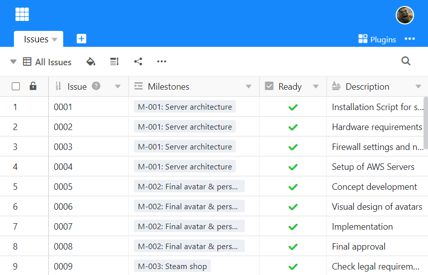

Chaque fois que vous consultez vos données dans un tableau, vous le faites via une **vue**. Même si vous avez créé un tout nouveau tableau, vous le consultez déjà dans la **vue "Default View"** fournie par défaut **.**

## À quoi servent les vues ?

Dans un tableur traditionnel comme Excel, chaque utilisateur voit le contenu des feuilles de calcul de la même manière - si vous masquez des colonnes, par exemple, la colonne sera également masquée chez tous les autres utilisateurs.

SeaTable vous permet de créer des vues, c'est-à-dire de définir **les** informations que vous souhaitez afficher à l'aide de **filtres, de tris, de regroupements** et de **masquages**. Vous pouvez ainsi afficher exactement les données qui vous intéressent.

Qu'est-ce que cela signifie ? Voici quelques **exemples de vues** que vous pouvez créer :

- Si vous avez un tableau de tâches, vous pouvez créer une vue distincte pour chaque collaborateur, qui n'affichera que les tâches attribuées à un collaborateur donné.
- Si vous avez un tableau avec beaucoup de colonnes, vous pouvez créer une vue qui masque certaines colonnes, rendant ainsi le tableau plus clair.
- Si vous disposez d'un tableau de rendez-vous clients, vous pouvez créer une vue de calendrier qui présente tous vos rendez-vous clients dans un calendrier mensuel.

Il est important de comprendre qu'une vue n'est qu'une autre façon de voir **les mêmes données sous-jacentes**! Cela signifie que si vous modifiez les données d'une table dans une vue, ces données changent dans toutes les vues de la table, car toutes les vues considèrent le même ensemble de données.

## Le tableau comme représentation standard d'une vue

L'**affichage sous forme de tableau** est le mode d'affichage standard dans une base SeaTable. Elle ressemble beaucoup à une feuille de calcul, car les enregistrements sont organisés en lignes et en colonnes.

D'autres représentations comme le calendrier, la galerie ou le Kanban peuvent être utilisées sous forme de [plugins](https://seatable.io/fr/docs/arbeiten-mit-plugins/was-ist-ein-plugin/).

## Autres articles sur le thème des vues

- [Créer une nouvelle vue]()
- [Renommer une vue]()
- [Supprimer une vue](https://seatable.io/fr/docs/grundlagen-von-ansichten/loeschen-einer-ansicht/)
- [La duplication de vues](https://seatable.io/fr/docs/grundlagen-von-ansichten/das-duplizieren-von-ansichten/)
- [Différences entre les vues privées et les vues normales]()
- [L'impression d'une vue](https://seatable.io/fr/docs/grundlagen-von-ansichten/das-drucken-einer-ansicht/)
- [Modifier l'ordre des vues](https://seatable.io/fr/docs/grundlagen-von-ansichten/die-reihenfolge-von-ansichten-aendern/)
- [Regrouper les vues dans des dossiers](https://seatable.io/fr/docs/grundlagen-von-ansichten/ansichten-in-ordnern-gruppieren/)
- [Filtrer les entrées d'une vue](https://seatable.io/fr/docs/ansichtsoptionen/filtern-von-eintraegen-in-einer-ansicht/)
- [Relier les règles de filtrage avec ET et OU](https://seatable.io/fr/docs/ansichtsoptionen/filter-regeln-mit-und-und-oder-verknuepfen/)
- [Trier les entrées d'une vue](https://seatable.io/fr/docs/ansichtsoptionen/sortieren-von-eintraegen-in-einer-ansicht/)
- [Regrouper des entrées dans une vue](https://seatable.io/fr/docs/ansichtsoptionen/gruppieren-von-eintraegen-in-einer-ansicht/)
- [Coloration de cellules]()
- [Marquage couleur des cellules]()
- [Ajuster la hauteur des lignes]()
- [Ajuster le nombre de colonnes épinglées](https://seatable.io/fr/docs/ansichtsoptionen/anzahl-der-fixierten-spalten-anpassen/)
- [Masquer et déplacer des colonnes]()
- [Verrouiller les vues](https://seatable.io/fr/docs/ansichtsoptionen/ansicht-sperren/)
- [Partage d'une vue avec un membre de l'équipe](https://seatable.io/fr/docs/ansichtsfreigaben/freigabe-einer-ansicht-an-ein-teammitglied/)
- [Créer un lien externe pour une vue](https://seatable.io/fr/docs/ansichtsfreigaben/externen-link-fuer-eine-ansicht-erstellen/)
