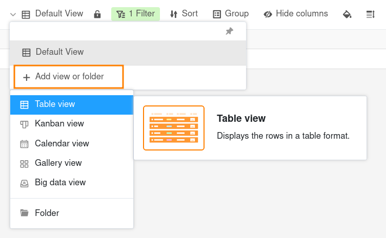
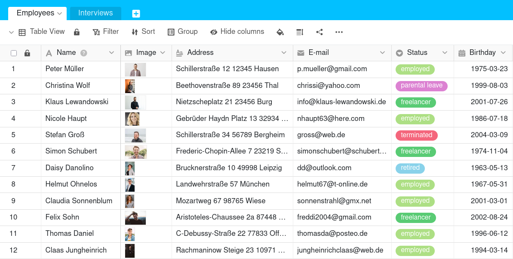
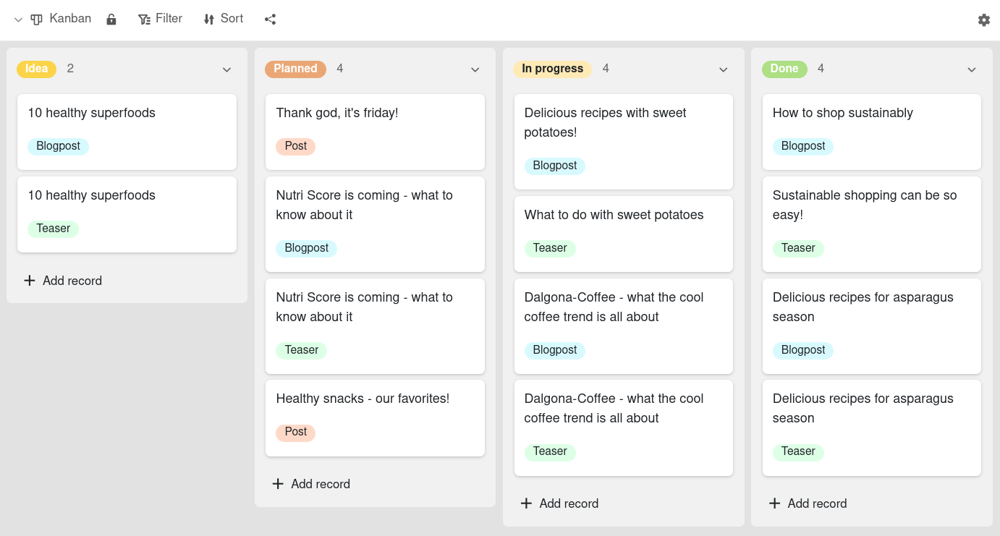
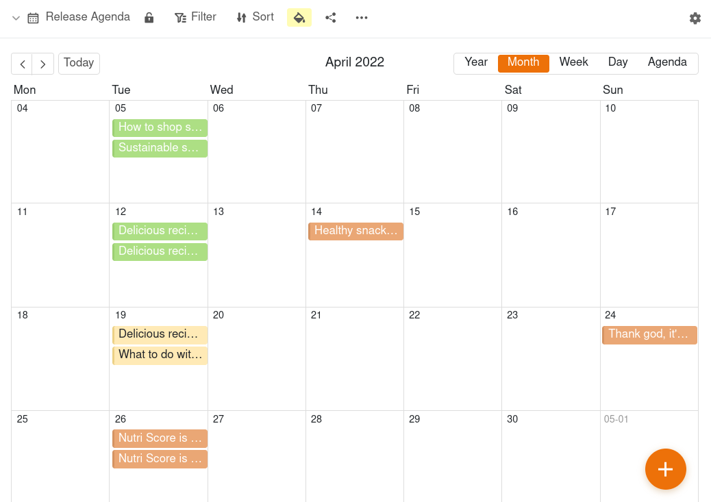

Sempre que visualiza os seus dados numa tabela, visualiza-os através de uma **vista**. Mesmo que tenha criado uma nova tabela, já está a visualizá-la na vista **"Default View"** fornecida como padrão.

## Para que são utilizadas as vistas?

Numa tabela convencional, vê sempre os dados da mesma forma. Embora possa adicionar ou eliminar linhas e colunas, não pode ver os mesmos dados de ângulos diferentes.

No SeaTable, pode criar vistas e utilizar **filtros, ordenação, agrupamento, ocultação, realce de cores e altura da linha** para determinar que secção dos seus dados pretende visualizar e como. Isto permite-lhe apresentar exatamente os dados que são relevantes para si, sem ter de alterar ou eliminar registos de dados.

Também pode selecionar determinados formatos de visualização para visualizar os dados de uma forma apelativa. Eis alguns exemplos de **tipos de vistas** que pode criar:

- Vista de tabela
- Vista Kanban
- Vista de calendário
- Vista de galeria
- Vista de Big Data

É importante compreender que uma vista é apenas outra forma de ver **os mesmos dados subjacentes**! Isto significa que se editar os dados de uma tabela numa vista, esses dados são alterados em todas as vistas da tabela, uma vez que todas as vistas representam o mesmo conjunto de dados.



Pode utilizar outros formatos de visualização, como organogramas, árvores ou mapas, sob a forma de [plugins]().



## A vista de tabela

A **vista de tabela** é o formato de visualização padrão num SeaTable Base. É muito semelhante a uma folha de cálculo, uma vez que os registos de dados estão organizados em linhas e colunas.

Se criar uma vista filtrada ou ocultar colunas, verá apenas a quantidade de dados de que necessita. Também pode organizar a vista de forma mais clara, ordenando ou agrupando de acordo com determinados princípios de ordenação.

## A vista Kanban

Se tiver **colunas com um número limitado de opções** na sua tabela, pode resumir as suas linhas em grupos. Uma forma especial de exibição é a **vista Kanban**. Ela é particularmente adequada para visualizar **processos com diferentes fases**.

Pode obter mais informações sobre este assunto no artigo sobre a [vista Kanban]().

## A vista de calendário

Se tiver uma tabela com **colunas de data**, pode criar uma vista de calendário que organiza todos os seus registos de dados **cronologicamente**.

Pode obter mais informações sobre este assunto no artigo sobre a [vista de calendário]().

## A vista de galeria

Se tiver uma tabela com uma coluna de **imagem**, pode criar uma vista de galeria para ilustrar os registos de dados com imagens de pré-visualização.

Pode obter mais informações sobre este assunto no artigo sobre a [vista de galeria]().

## A vista de Big Data

Se tiver ativado o **Armazenamento de Big Data** na sua Base, pode arquivar **grandes quantidades de dados** que não são imediatamente visíveis para todos os utilizadores. É necessária uma vista especial de Big Data para aceder aos dados no armazenamento de Big Data.

Pode obter mais informações sobre este assunto no artigo sobre a [vista de Big Data]().

## Mais artigos sobre o tema de vistas

- [Criar uma nova vista]()
- [Renomear uma vista]()
- [Apagar uma vista]()
- [Duplicação de vistas]()
- [Diferenças entre vistas privadas e normais]()
- [Imprimir uma vista]()
- [Alterar a ordem de vistas]()
- [Agrupar vistas em pastas]()
- [Filtragem de entradas numa vista]()
- [Ligação das regras de filtragem com AND e OR]()
- [Ordenar as entradas numa vista]()
- [Agrupar entradas numa vista]()
- [Colorir células]()
- [Marcação a cores das células]()
- [Ajustar a altura da fila]()
- [Ajustar o número de colunas fixas]()
- [Esconder e mover colunas]()
- [Bloquear uma vista]()
- [Partilhar uma vista com um membro da equipa]()
- [Criar uma ligação externa para uma vista]()
