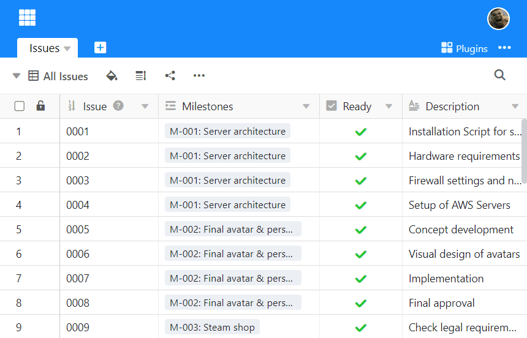

Всякий раз, когда вы просматриваете данные в таблице, вы просматриваете их с помощью **представления**. Даже если вы создали совершенно новую таблицу, вы уже просматриваете ее в **"Представлении по умолчанию"**, предусмотренном по умолчанию.

## Для чего используются виды?

В обычных электронных таблицах, таких как Excel, все пользователи видят содержимое таблиц одинаково - например, если вы скрываете столбцы, они также скрываются для всех остальных пользователей.

В SeaTable вы можете создавать представления, то есть определять **, какую** информацию вы хотите просматривать, используя **фильтры, сортировку, группировку** и **скрытие**. Таким образом, вы можете отображать именно те данные, которые актуальны для вас индивидуально.

Что это значит? Вот несколько **примеров представлений**, которые вы можете создать:

- Если у вас есть таблица задач, вы можете создать отдельное представление для каждого сотрудника, которое показывает только задачи, назначенные конкретному сотруднику.
- Если у вас есть таблица с большим количеством столбцов, вы можете создать представление, которое скрывает определенные столбцы, делая таблицу более понятной.
- Если у вас есть электронная таблица встреч с клиентами, вы можете создать представление календаря, которое показывает все ваши встречи с клиентами в ежемесячном календаре.

Важно понимать, что представление - это просто другой способ взглянуть на те **же самые базовые данные**! Это означает, что если вы отредактируете данные таблицы в одном представлении, эти данные изменятся во всех представлениях таблицы, поскольку все представления просматривают один и тот же набор данных.

## Таблица как стандартное представление представления

**Табличный вид** является форматом отображения по умолчанию в SeaTable Base. Он очень похож на электронную таблицу, поскольку записи организованы в виде строк и столбцов.

Вы можете использовать другие представления, такие как календарь, галерея или канбан, в виде [плагинов](https://seatable.io/ru/docs/arbeiten-mit-plugins/was-ist-ein-plugin/).

## Другие статьи на тему взглядов

- [Создайте новое представление]()
- [Переименовать представление](https://seatable.io/ru/docs/grundlagen-von-ansichten/umbenennen-einer-ansicht/)
- [Удалить представление](https://seatable.io/ru/docs/grundlagen-von-ansichten/loeschen-einer-ansicht/)
- [Дублирование представлений](https://seatable.io/ru/docs/grundlagen-von-ansichten/das-duplizieren-von-ansichten/)
- [Различия между частными и обычными видами](https://seatable.io/ru/docs/grundlagen-von-ansichten/unterschiede-zwischen-privaten-und-normalen-ansichten/)
- [Печать представления](https://seatable.io/ru/docs/grundlagen-von-ansichten/das-drucken-einer-ansicht/)
- [Изменение порядка просмотра](https://seatable.io/ru/docs/grundlagen-von-ansichten/die-reihenfolge-von-ansichten-aendern/)
- [Группировка представлений в папках](https://seatable.io/ru/docs/grundlagen-von-ansichten/ansichten-in-ordnern-gruppieren/)
- [Фильтрация записей в представлении](https://seatable.io/ru/docs/ansichtsoptionen/filtern-von-eintraegen-in-einer-ansicht/)
- [Связывание правил фильтрации с помощью AND и OR](https://seatable.io/ru/docs/ansichtsoptionen/filter-regeln-mit-und-und-oder-verknuepfen/)
- [Сортировка записей в представлении](https://seatable.io/ru/docs/ansichtsoptionen/sortieren-von-eintraegen-in-einer-ansicht/)
- [Группировка записей в представлении](https://seatable.io/ru/docs/ansichtsoptionen/gruppieren-von-eintraegen-in-einer-ansicht/)
- [Окрашивание клеток]()
- [Цветовая маркировка клеток]()
- [Отрегулируйте высоту ряда]()
- [Настройте количество фиксированных столбцов](https://seatable.io/ru/docs/ansichtsoptionen/anzahl-der-fixierten-spalten-anpassen/)
- [Скрытие и перемещение столбцов]()
- [Виды замков](https://seatable.io/ru/docs/ansichtsoptionen/ansicht-sperren/)
- [Обмен мнениями с членом команды](https://seatable.io/ru/docs/ansichtsfreigaben/freigabe-einer-ansicht-an-ein-teammitglied/)
- [Создание внешней ссылки для представления](https://seatable.io/ru/docs/ansichtsfreigaben/externen-link-fuer-eine-ansicht-erstellen/)
