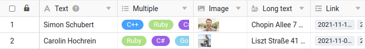

Par défaut, SeaTable affiche toutes les lignes avec une hauteur de ligne compacte afin d'afficher le plus grand nombre possible d'enregistrements. Or, cette **hauteur de ligne simple** a pour effet, entre autres, de tronquer les colonnes de [texte](), de [lien]()  et [de sélections multiples](), et de n'afficher que de **miniatures des images**.

Cette hauteur de ligne peut convenir à la plupart de vos applications, mais il peut aussi y avoir des situations où vous souhaitez voir plus de contenu dans chaque ligne. C'est pourquoi SeaTable vous permet d'ajuster la hauteur des lignes dans chacune de vos vues.

Concrètement, vous disposez pour cela de quatre hauteurs de ligne différentes :

- Simple (la valeur par défaut pour les nouveaux tableaux)
- Double
- Triple
- Quadruple

## Ajuster la hauteur des lignes

1. Dans les options de vue, cliquez sur l'icône de la **hauteur de ligne**.
2. **Sélectionnez** la hauteur de ligne souhaitée.


