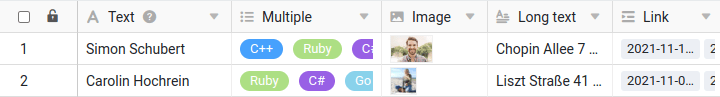

По умолчанию SeaTable отображает все строки с компактной высотой строки, чтобы показать как можно больше записей. Однако при такой **простой высоте строки**, помимо прочего, обрезаются [колонки]() и [множественным выбором](), а также отображаются только маленькие **эскизы** изображений.

Такая высота строки может подойти для большинства случаев использования, но могут быть ситуации, когда вы хотите видеть больше содержимого соответствующих строк. Именно поэтому SeaTable позволяет настраивать высоту строк в каждом из представлений.

Для этого доступны четыре варианта высоты линии:

- Simple (значение по умолчанию для новых таблиц и представлений)
- Двойной
- Тройной
- Четырехсторонний

## Отрегулируйте высоту ряда

1. Нажмите на значок **высоты строки** в опциях просмотра.
2. **Выберите** нужную высоту ряда.
   
