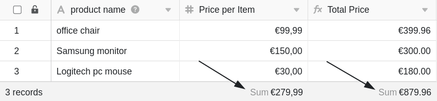

La **línea de estado** se encuentra en la parte inferior de sus mesas y cumple básicamente dos funciones diferentes, que se explican con más detalle en este artículo:

- **Función 1**: Contar las filas de una vista
- **Función 2**: Indicación de un valor calculado a partir de todas las entradas (por ejemplo, suma, media, etc.) en el caso de columnas numéricas.

Gracias a la línea de estado, siempre tendrá a la vista estos **valores estadísticos** básicos en cuanto abra una tabla.

## Contar las filas de una vista

La línea de estado indica en el borde inferior izquierdo el número de todas las **filas** que hay en la vista de **tabla** abierta en ese momento. Si [filtra en una](https://seatable.io/es/docs/ansichtsoptionen/filtern-von-eintraegen-in-einer-ansicht/) vista, la línea de estado cuenta sólo las entradas restantes de la tabla.

Además, puede [seleccionar líneas](https://seatable.io/es/docs/arbeiten-mit-zeilen/mehrere-zeilen-selektieren/) individuales - entonces la línea de estado se refiere sólo a las entradas seleccionadas.

## Indicación de un valor calculado a partir de todas las entradas

Para las **columnas basadas en números**, la línea de estado de cada columna da un **valor** calculado a partir de todas las entradas.

## Opciones de cálculo

Para las columnas basadas en números, las siguientes **opciones de cálculo** están disponibles en la línea de estado:

- Cálculo de la **suma de** todas las entradas de la columna
- Cálculo del **valor medio** de todas las entradas de la columna
- Cálculo de la **mediana** a partir de todas las entradas de la columna
- Determinar el **valor máximo** de todas las entradas de la columna
- Determinar el **valor mínimo** de todas las entradas de la columna
- Ningún cálculo

## Tipos de columnas y formatos compatibles

Para los siguientes tipos de columna, la línea de estado refleja un valor calculado:

- [Columnas numéricas](https://seatable.io/es/docs/text-und-zahlen/die-zahlen-spalte/)
    - Número
    - Porcentaje
    - Moneda
- [Columnas permanentes](https://seatable.io/es/docs/datum-dauer-und-personen/die-dauer-spalte/)
- [Columnas de clasificación](https://seatable.io/es/docs/auswahlspalten/die-rating-spalte/)
- Valores numéricos en [columnas de fórmulas](https://seatable.io/es/docs/formeln/grundlagen-von-seatable-formeln/)

Para los siguientes tipos de columnas, la línea de estado **no** refleja un valor calculado, aunque (pueden) contener números:

- [Columnas de fecha](https://seatable.io/es/docs/datum-dauer-und-personen/die-datum-spalte/)
- [Creado](https://seatable.io/es/docs/datum-dauer-und-personen/die-spalten-ersteller-und-erstellt/) y [editado por última](https://seatable.io/es/docs/datum-dauer-und-personen/die-spalten-letzter-bearbeiter-und-zuletzt-bearbeitet/) vez
- [Número automático](https://seatable.io/es/docs/text-und-zahlen/der-spaltentyp-automatische-nummer/)
- Números en [columnas de texto](https://seatable.io/es/docs/text-und-zahlen/die-spalten-text-und-formatierter-text/)
