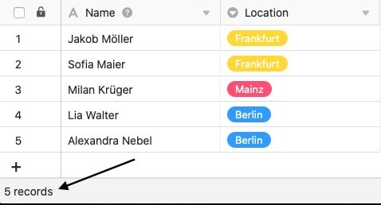
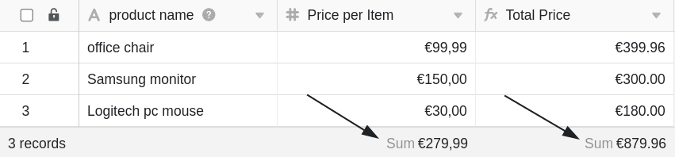
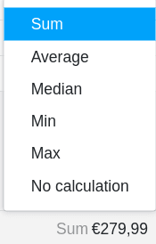

La **ligne d'état** se trouve en bas de vos tableaux et remplit fondamentalement deux fonctions différentes, qui sont expliquées plus en détail dans cet article :

- **Fonction 1**: Compter les lignes dans une vue
- **Fonction 2**: indication d'une valeur calculée à partir de toutes les entrées (par ex. somme, moyenne, etc.) pour les colonnes basées sur des chiffres

Grâce à la ligne d'état, vous avez toujours ces **valeurs statistiques de base** sous les yeux dès que vous avez ouvert un tableau.

## Compter les lignes dans une vue

La ligne d'état indique en bas à gauche le nombre de toutes les **lignes** qui se trouvent dans la **vue de tableau** actuellement ouverte. Si vous [filtrez dans une vue](https://seatable.io/fr/docs/ansichtsoptionen/filtern-von-eintraegen-in-einer-ansicht/), la ligne d'état ne compte que les entrées de tableau restantes.

En outre, vous pouvez [sélectionner](https://seatable.io/fr/docs/arbeiten-mit-zeilen/mehrere-zeilen-selektieren/) des [lignes](https://seatable.io/fr/docs/arbeiten-mit-zeilen/mehrere-zeilen-selektieren/) individuelles - la ligne d'état ne se réfère alors qu'aux entrées sélectionnées.

## Indication d'une valeur calculée à partir de toutes les entrées

Pour les **colonnes basées sur des chiffres**, la ligne d'état indique pour chaque colonne une **valeur** calculée à partir de toutes les entrées.

## Options de calcul

Pour les colonnes basées sur des chiffres, les **options de calcul** suivantes sont disponibles dans la ligne d'état :

- Calcul de la **somme** de toutes les entrées de la colonne
- Calcul de la **moyenne** de toutes les entrées de la colonne
- Calcul de la **médiane** à partir de toutes les entrées de la colonne
- Détermination de la **valeur maximale** à partir de toutes les entrées de la colonne
- Détermination de la **valeur minimale** à partir de toutes les entrées de la colonne
- Pas de calcul

## Types de colonnes et formats compatibles

Pour les types de colonnes suivants, la ligne d'état indique une valeur calculée :

- [Colonnes de chiffres](https://seatable.io/fr/docs/text-und-zahlen/die-zahlen-spalte/)
    - Nombre
    - Pourcentage
    - Monnaie
- [Colonnes permanentes](https://seatable.io/fr/docs/datum-dauer-und-personen/die-dauer-spalte/)
- [Colonnes de notation](https://seatable.io/fr/docs/auswahlspalten/die-rating-spalte/)
- Valeurs numériques dans [les colonnes de formules](https://seatable.io/fr/docs/formeln/grundlagen-von-seatable-formeln/)

Pour les types de colonnes suivants, la ligne d'état ne donne **pas** de valeur calculée, bien qu'ils contiennent (ou puissent contenir) des chiffres :

- [Colonnes de dates](https://seatable.io/fr/docs/datum-dauer-und-personen/die-datum-spalte/)
- [Créé](https://seatable.io/fr/docs/datum-dauer-und-personen/die-spalten-ersteller-und-erstellt/) et [dernièrement modifié](https://seatable.io/fr/docs/datum-dauer-und-personen/die-spalten-letzter-bearbeiter-und-zuletzt-bearbeitet/)
- [Numéro automatique](https://seatable.io/fr/docs/text-und-zahlen/der-spaltentyp-automatische-nummer/)
- Chiffres dans [les colonnes de texte](https://seatable.io/fr/docs/text-und-zahlen/die-spalten-text-und-formatierter-text/)
