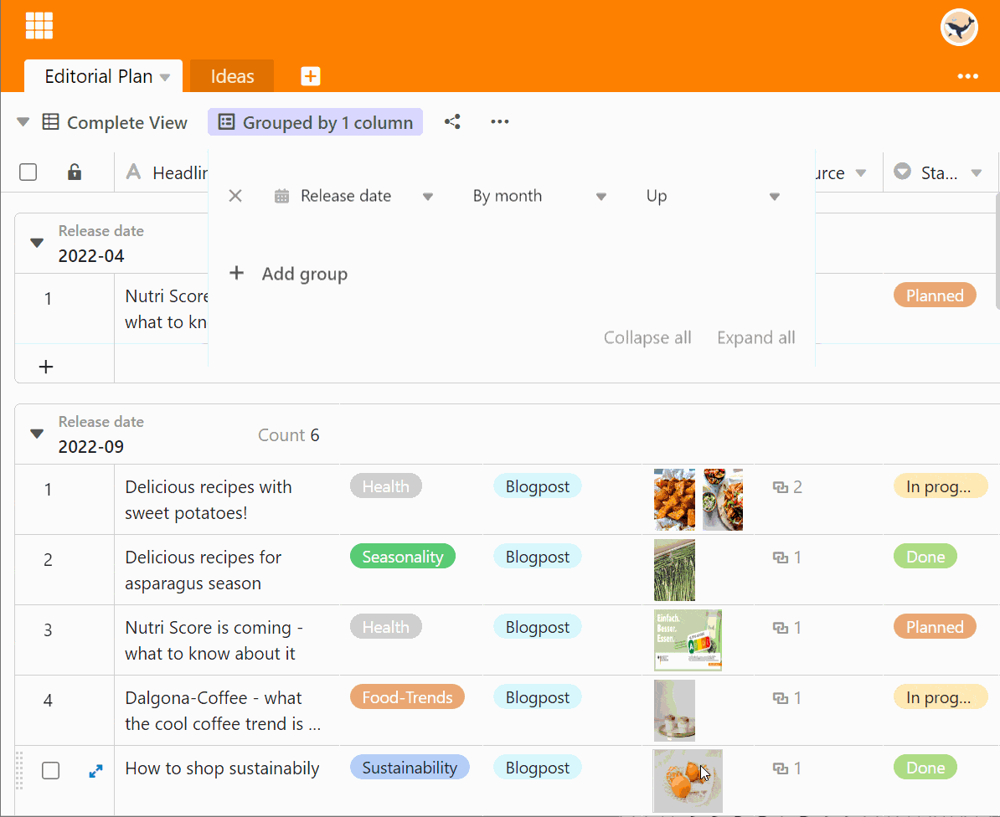
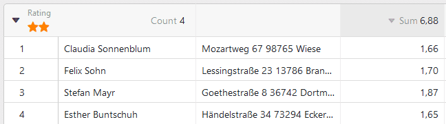
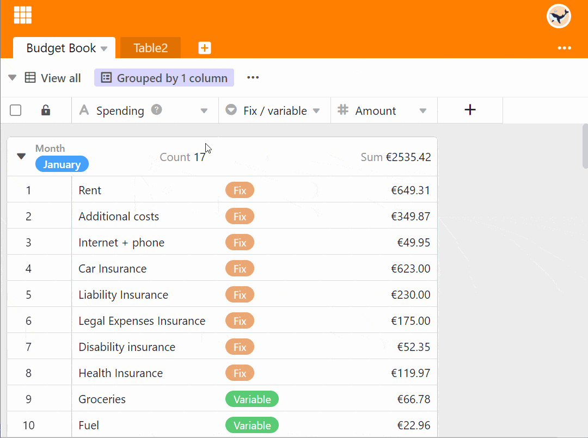
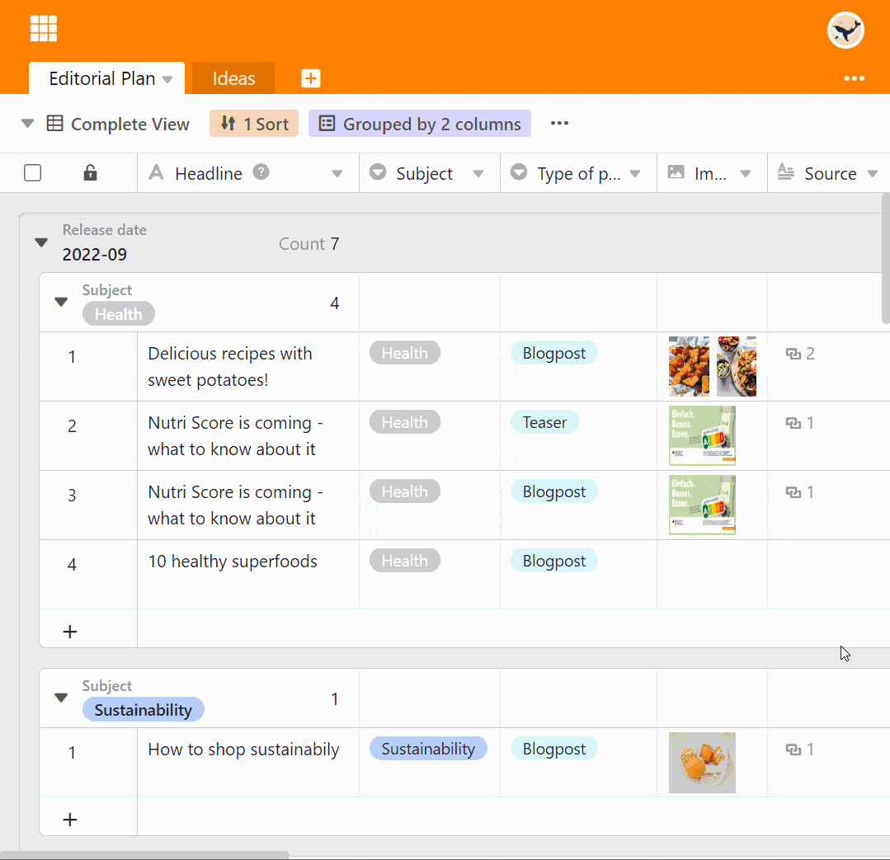

Com a função de agrupamento, é possível combinar as entradas da tabela em **agrupamentos** e determinar estatísticas descritivas simples tais como o número de elementos ou totais e valores médios das colunas de números.

## Entradas em grupo numa vista

1. Crie uma [nova vista](https://seatable.io/pt/docs/grundlagen-von-ansichten/anlegen-einer-neuen-ansicht/) ou seleccione a vista em que pretende agrupar.
2. Clique na opção **Grupo** nas opções de visualização acima da tabela.
3. Ir para **Adicionar Agrupamento**.
4. No campo vazio, seleccione a **coluna** pela qual pretende agrupar.
5. Decidir no segundo campo se o agrupamento deve ser listado em ordem **ascendente** ou **descendente**.

## Níveis de grupo

Pode **agrupar de acordo com até três critérios ao mesmo tempo**, acrescentando outros agrupamentos. Isto cria vários níveis ou subgrupos dentro dos agrupamentos.



## O cabeçalho do grupo

Cada grupo tem um cabeçalho no qual tanto o critério do grupo como o número de entradas dentro do grupo são listados.

No caso de **colunas de pagamento**, também tem a opção de exibir várias relações entre as entradas:

- Total
- Média
- Median
- Mínimo
- Máximo
- Nenhum cálculo

Clique no **ícone triangular** em frente ao título da coluna de pagamento para seleccionar a respectiva opção.

## Reduzir e expandir os registos apresentados

Usando o **ícone drop-down** triangular à esquerda no cabeçalho do grupo, pode reduzir e expandir **individualmente** a exibição de registos em cada grupo individual.

Ao utilizar as opções **Reduzir Tudo** ou **Expandir Tudo**, pode colapsar e expandir a exibição de registos em todos os grupos com um clique.

### Reduzir tudo

Aqui encontrará a opção **Reduzir Tudo**:

**Reduzir** a visualização com a opção **Todos** activada:

### Expandir tudo

Aqui encontrará a opção **Expandir tudo**:

**Expandir o** visor com a opção **Todos** activada:

## Mover as entradas para outro grupo

Pode atribuir entradas individuais a novos grupos, arrastando e largando. O critério em que o grupo se baseia é ajustado quando a entrada é deslocada.

## Ungroup

É claro que pode eliminar grupos em qualquer altura, clicando no **símbolo x** em frente do respectivo grupo.

