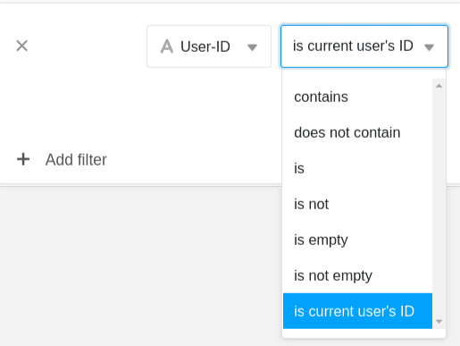
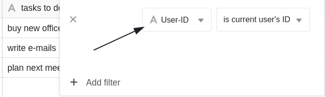
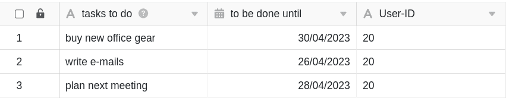
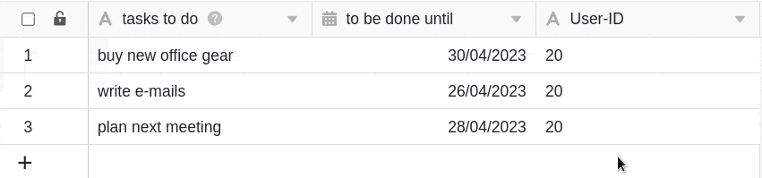
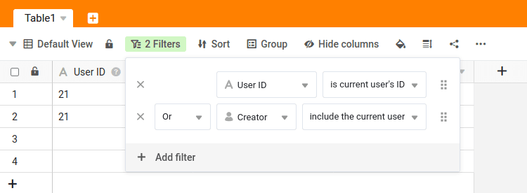
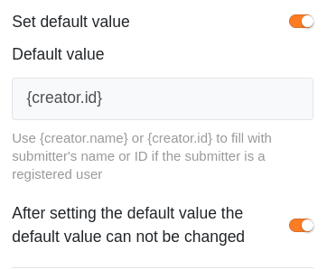

L'ID de l'utilisateur se décrit le mieux par un **numéro d'identification personnel**. L'ID de l'utilisateur est unique au sein de l'équipe et appartient toujours à un membre de l'équipe.

L'ID d'utilisateur permet de définir **des filtres dynamiques** dans SeaTable, ce qui, dans certaines situations, est plus approprié qu'un filtre basé sur la [colonne du créateur](https://seatable.io/fr/docs/datum-dauer-und-personen/die-spalten-ersteller-und-erstellt/). Dans cet article, nous vous présentons les avantages et les inconvénients des filtres avec l'ID utilisateur.

Si vous voulez savoir comment modifier l'ID utilisateur d'un membre de l'équipe, [vous trouverez la réponse dans cet article d'aide](https://seatable.io/fr/docs/teamverwaltung-abonnement/aenderung-der-id-des-users-in-der-teamverwaltung/).



## Filtrer avec l'ID utilisateur

Dans SeaTable, vous pouvez utiliser le filtre **"is current user's ID"** pour chaque colonne de texte. Cela crée un **filtre dynamique** qui n'affiche que les entrées dont l'**ID utilisateur** est enregistré dans la [colonne de texte](https://seatable.io/fr/docs/text-und-zahlen/die-spalten-text-und-formatierter-text/) correspondante.

### Exemple d'application

Supposons que vous ayez **trois employés** et qu'ils aient les **identifiants** suivants :

- Markus avec l'ID **20**
- Helmut avec l'ID **23**
- Sven avec l'ID **56**

Si vous gérez par exemple un tableau dans lequel vous saisissez les tâches ouvertes de vos trois collaborateurs et que vous définissez un tel **filtre**, ...

... sera ...

-  ... Marc ne verra **que** les entrées pour lesquelles son **ID utilisateur** individuel **20** est saisi dans la colonne correspondante.

-  ... Helmut ne verra **que** les entrées pour lesquelles son **ID utilisateur** individuel **23** est saisi dans la colonne correspondante.
-  ... Sven ne peut voir **que** les entrées pour lesquelles son **ID utilisateur** individuel **56** est saisi dans la colonne correspondante.

## Quand un tel filtre est-il utile ?

L'alternative serait de filtrer selon la colonne [Créateur](https://seatable.io/fr/docs/datum-dauer-und-personen/die-spalten-ersteller-und-erstellt/) ou [Collaborateur](https://seatable.io/fr/docs/datum-dauer-und-personen/die-spalte-mitarbeiter/), qui offrent également des possibilités de filtrage dynamique. Ces deux colonnes présentent toutefois les inconvénients suivants :

- La **valeur dans la colonne "Créateur** " ne peut _plus_ être **modifiée** ultérieurement. Une fois définie, la valeur reste toujours la même. Cela poserait problème dans l'exemple ci-dessus, car le créateur des tâches n'est _pas_ le collaborateur.
- La **colonne des collaborateurs** ne peut être remplie que si un membre de l'équipe a au moins **un accès en lecture** à la base. Cela n'est peut-être _pas_ souhaitable, en particulier lors de l'utilisation de l'[application universelle](https://seatable.io/fr/docs/apps/universelle-app/).
- La colonne des collaborateurs ne peut _pas_ être **remplie automatiquement via le formulaire web**. Par contre, l'ID de l'utilisateur peut être définie comme valeur par défaut par l'attribution de _{creator.id}_.

Vous pouvez adapter à tout moment l'**ID utilisateur** inscrit dans la colonne de texte. Ainsi, si vous souhaitez modifier **ultérieurement** l'attribution d'une ligne, le filtrage selon l'ID utilisateur est très utile.

### Exemple : attribution de tâches

Imaginez une liste de choses à faire qui vous permette de saisir des tâches dans SeaTable. La **colonne Créateur** n'est _pas_ envisageable pour l'attribution du responsable, car les membres de l'équipe ne pourraient alors que créer eux-mêmes des tâches et se les attribuer. La **colonne des collaborateurs** est la solution la plus évidente, mais uniquement si tous les membres de l'équipe ont au moins un accès en lecture à la base. Si les collaborateurs ne doivent en aucun cas voir les tâches de leurs collègues, il est recommandé d'utiliser l'ID utilisateur pour attribuer le responsable.

Si vous attribuez la tâche ouverte _"plan next meeting"_ de _Markus_ à un autre collaborateur, c'est-à-dire si vous modifiez l'**ID de l'utilisateur** dans cette ligne, par exemple de _20 (Markus)_ à _23 (Helmut)_, la ligne correspondante est automatiquement **filtrée** de la vue tableau de Markus et ajoutée à la vue tableau de Helmut.

Si la tâche doit être affichée non seulement à l'utilisateur avec l'ID correspondant, mais aussi au créateur de la ligne, vous pouvez définir **deux règles de filtrage** avec un [lien "ou bien"](https://seatable.io/fr/docs/ansichtsoptionen/filter-regeln-mit-und-und-oder-verknuepfen/).

## ID de l'utilisateur dans les formulaires web

Dans les [formulaires web](https://seatable.io/fr/docs/webformulare/webformulare/), vous pouvez saisir automatiquement l'**identité des utilisateurs connectés**. Pour ce faire, définissez **{creator.id}** ou **{creator.name}** comme **valeur par défaut** dans les paramètres de page de votre formulaire web et activez l'option pour qu'elle ne puisse _pas_ être modifiée. Une fois que vous avez effectué ces réglages, l'**ID de l'utilisateur connecté** est **automatiquement** inséré dans le formulaire web et ne peut plus être saisi ou modifié manuellement.

