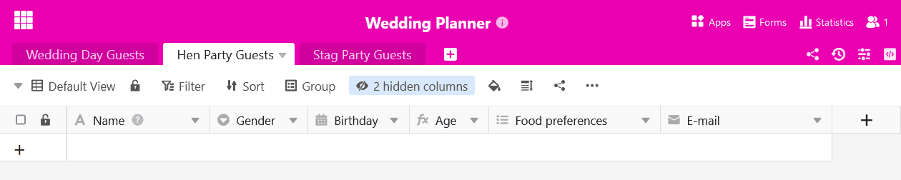

Sie benötigen eine Tabelle in Ihrer Base mehrmals in leicht abgewandelter Form? Dann können Sie diese mit wenigen Mausklicks duplizieren. So einfach geht es:

1. Im Base-Header finden Sie oben links alle Tabellen der Base als **Reiter** dargestellt.
2. Klicken Sie auf das **Drop-down-Symbol** neben dem **Namen der Tabelle**, die Sie duplizieren möchten.

 4. Klicken Sie auf **Tabelle duplizieren**. 5. Entscheiden Sie, ob die Tabelle **leer oder mit Einträgen** dupliziert werden soll, indem Sie den Regler aktivieren.

 7. Bestätigen Sie mit **Abschicken**.



**So sieht das Ergebnis mit duplizierten Einträgen aus**

Diese Option ist sinnvoll, wenn Sie zumindest einen Teil der Zeilen aus der ursprünglichen Tabelle übernehmen möchten.

**So sieht das Ergebnis ohne duplizierte Einträge aus**

Diese Option ist sinnvoll, wenn Sie nur die **Struktur** der ursprünglichen Tabelle übernehmen, sie aber mit anderen Einträgen füllen wollen. Das kann zum Beispiel vorkommen, wenn Sie für Ihre [Budgetplanung](https://seatable.io/budgetplanung-vorlage/) eine Tabelle pro Jahr anlegen.
