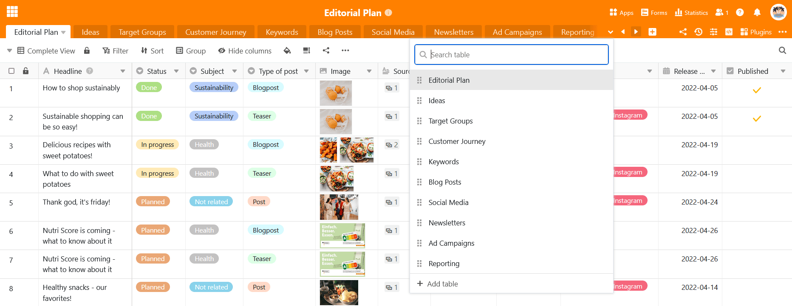
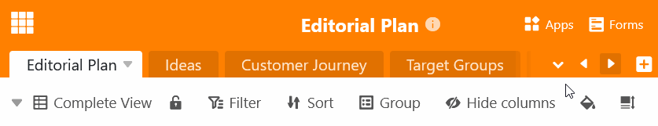

En las bases con un gran número de tablas, no se pueden mostrar todas las **fichas en la cabecera de la base**. Incluso las [tablas ocultas](https://seatable.io/es/docs/arbeiten-in-tabellen/tabellen-ausblenden/) ya no se pueden encontrar en la cabecera de la base. Por ello, SeaTable ofrece la posibilidad de buscar una **tabla**.

- Haga clic en la **flecha desplegable** situada a la derecha de la última tabla visible.
- Desplácese por la **lista de tablas** o introduzca parte del nombre de la tabla en el **campo de búsqueda**.
- Haga clic en el **nombre de** la tabla para abrir la tabla deseada.

También puede encontrar tablas en la cabecera base utilizando los **botones de flecha**  y .


