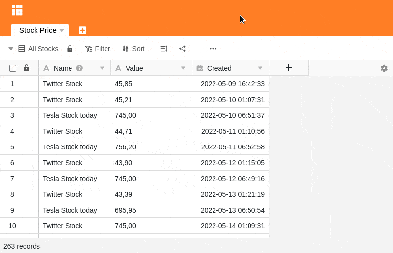

SeaTable offers you a comfortable function to search for all entries of a specific value in a table and replace either specific individual values or all at once. You will be amazed at how easy this is.

## Search and replace individual values

1. Click on the **three dots** in the view options.
2. Select **Search and Replace**.
3. First, select the **column** in which you want to search for the corresponding value.
4. If you are looking exclusively for **exact matches**, **activate** the corresponding **slider**.
5. Then, in the **Search for** field, enter the corresponding **value** you are searching for.
6. In the **Replace with** field, enter any **value** you want to **replace** the searched value with.
7. After filling in all the fields, the **values found** in the table will be highlighted in **color**. With a click on **Replace** you can replace the currently **marked value**.

## Exact match

An **exact match** is always given only when you enter the value you are looking for in the table into the search field without any deviation. If the corresponding slider is **not** activated, search results will be displayed to you already after entering fractions of the searched value.

## Switch between the search terms

You can switch between the search results using **Back** and **Next.** This way you can quickly find the one value you specifically want to replace.
