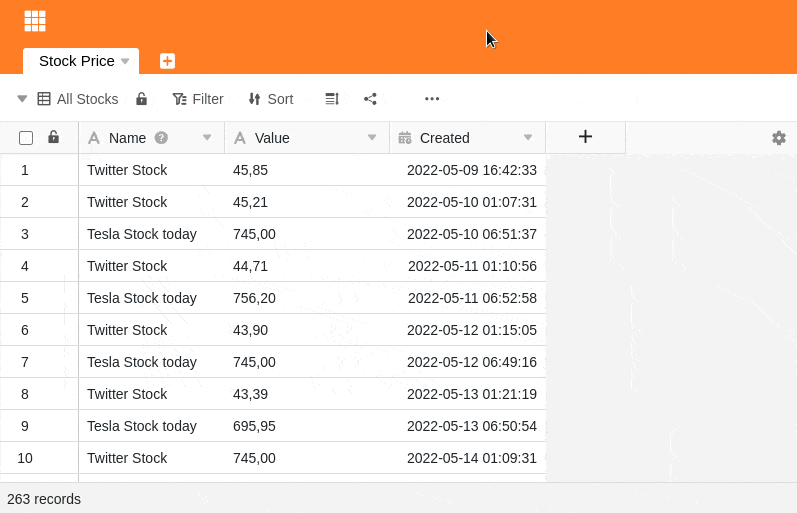

SeaTable vous offre une fonction pratique pour rechercher dans un tableau toutes les entrées d'une valeur spécifique et les remplacer soit de manière ciblée, soit toutes en même temps. Vous serez enthousiasmé par la simplicité de cette opération.

## Recherche et remplacement de valeurs individuelles

1. Cliquez sur les **trois points** dans les options d'affichage.
2. Sélectionnez **Rechercher et remplacer**.
3. Sélectionnez d'abord la **colonne** dans laquelle la valeur correspondante doit être recherchée.
4. Si vous recherchez uniquement **des correspondances exactes**, **activez** le **curseur** correspondant.
5. Dans le champ **Rechercher**, saisissez ensuite la **valeur** que vous recherchez.
6. Dans le champ **Remplacer par**, saisissez n'importe quelle **valeur** avec laquelle vous souhaitez **remplacer** la valeur recherchée.
7. Après avoir rempli tous les champs, les **valeurs trouvées** sont marquées **en couleur** dans le tableau. En cliquant sur **Remplacer**, vous pouvez remplacer la **valeur** actuellement **sélectionnée**.

## Correspondance exacte

Une **correspondance exacte** n'est garantie que si vous saisissez dans le champ de recherche la valeur que vous recherchez dans le tableau, sans aucune différence. Si le curseur correspondant n'est **pas** activé, les résultats de la recherche s'affichent déjà après la saisie de fractions de la valeur recherchée.

## Passage d'un terme de recherche à l'autre

Vous pouvez passer d'un résultat de recherche à l'autre à l'aide des boutons **Précédent** et **Suivant**. Vous trouverez ainsi rapidement la valeur que vous souhaitez remplacer.
