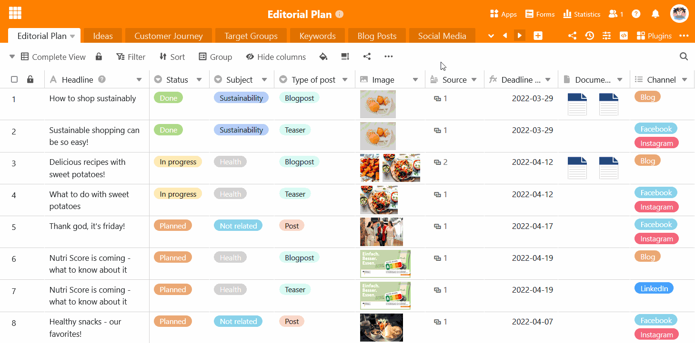

La cabecera de la base puede resultar confusa, especialmente para bases con un gran número de tablas. Por esta razón, SeaTable ofrece la opción de **ocultar** las **tablas** menos utilizadas. Una tabla oculta ya no se muestra como pestaña en la cabecera de la base y sólo se puede acceder a ella a través del **menú desplegable**.

- Haga clic en la **flecha desplegable** situada a la derecha de la última tabla visible.
- Mueva el ratón sobre la **lista de tablas** y haga clic en el **símbolo del ojo** situado a la derecha de cada tabla que desee ocultar.
- Las **pestañas** de las tablas correspondientes desaparecen y aparece una **nota permanente** en la cabecera base indicando cuántas tablas están ocultas.

Puede **trabajar** en una tabla oculta del mismo modo que en una tabla visible, **sin ninguna restricción**. Si desea volver a **mostrar** una tabla en la cabecera base, proceda exactamente del mismo modo que se describe en las instrucciones anteriores.


