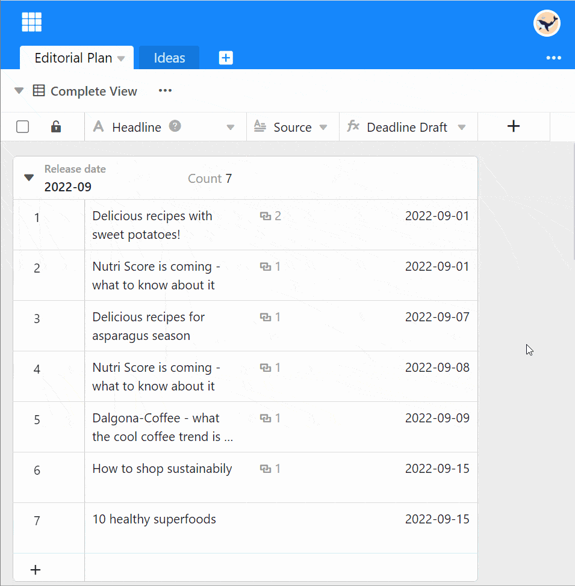



With an appropriate subscription you have the possibility in SeaTable to restrict the use and editing of your tables or to block them for certain users.

## Set permissions within tables

1. Click the **triangular drop-down icon** next to the table name.
2. Select the **Edittable permission** option.
3. You can now select in the following rows whether you want to use the authorization for **Administrators**, **Nobody**, **Specific user** or **Any** would like to issue.
    - Who may add rows ?
    - Who may delete rows ?
    - Who may edit rows ?
    - Who is allowed to see rows ?

## Frequently asked questions



What does only **administrators** mean?|||

By **administrators** here we do not mean the general team admins, but the administrators and owners of a group.

---

What happens if you create rows but are not allowed to see it?|||

This combination does not work. Only those who can see rows can also edit them or add new rows .


