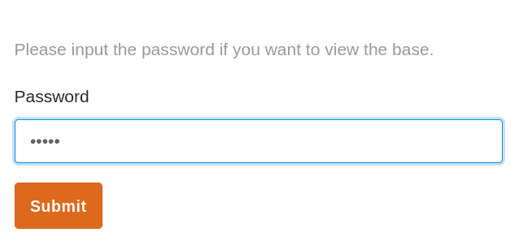
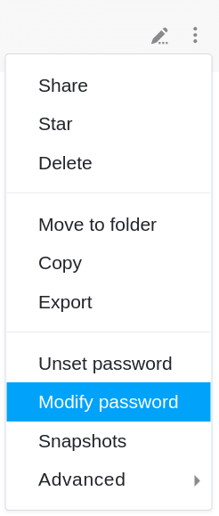
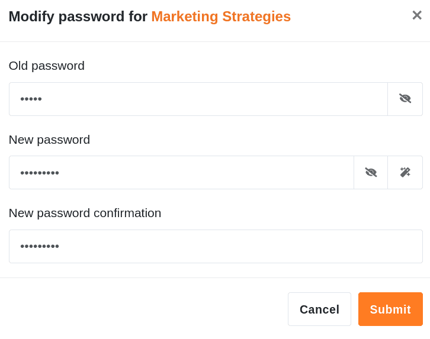

Um Ihre Bases vor unerwünschten Fremdzugriffen zu schützen, können Sie für jede Base ein beliebiges **Passwort** festlegen, das von jedem Benutzer, einschließlich Ihnen, korrekt eingegeben werden muss, um die entsprechende Base zu öffnen und anschließend bearbeiten zu können.

Dies ergibt vor allem bei **Gruppenbases** Sinn, auf die nicht alle Gruppenmitglieder zugreifen sollen. Auf Bases im Bereich **Meine Bases** haben sowieso nur Sie selbst Zugriff. Dort kann ein Passwort sinnvoll sein, wenn Sie [eine Base an eine Gruppe freigeben](https://seatable.io/docs/freigaben/eine-base-an-eine-gruppe-freigeben/).

## Passwort für eine Base festlegen

\[notice t="warning" h="Wichtiger Hinweis"\]Für Bases, die zu einer **Gruppe** gehören, sind ausschließlich **Eigentümer** und **Administratoren** dazu berechtigt, ein Passwort festzulegen. Einfachen Mitgliedern wird diese Option **nicht** angezeigt.\[/notice\]

1. Wechseln Sie zur **Startseite** von SeaTable.
2. Fahren Sie mit der Maus über die **Base**, für die Sie ein Passwort festlegen möchten.
3. Klicken Sie auf die rechts erscheinenden **drei Punkte**.
4. Klicken Sie auf **Passwort festlegen**.
5. Legen Sie ein **Passwort** für die Base fest.
6. Geben Sie das Passwort **ein zweites Mal** ein und bestätigen Sie mit **Absenden**.

## Passwort setzen

Nachdem Sie auf **Passwort festlegen** geklickt haben, öffnet sich ein Fenster, in dem Sie ein **Passwort mit beliebig vielen Buchstaben, Zahlen oder Sonderzeichen** setzen können. Geben Sie das Passwort in das vorgesehene **Feld** ein und **wiederholen** Sie dieses im zweiten Feld. Nutzen Sie bei Bedarf die beiden Optionen \[icon\]dtable-icon-eye-slash\[/icon\] und \[icon\]dtable-icon-random-generation\[/icon\] rechts neben dem ersten Eingabefeld, um das eingegebene **Passwort anzeigen** zu lassen bzw. ein **zufälliges Passwort** zu generieren.

## Passwortgeschützte Base

Bases, die mit einem Passwort geschützt sind, werden auf der Startseite stets mit einem **Schloss-Symbol** markiert.

Um Zugriff auf eine passwortgeschützte Base zu erhalten, muss **jeder** Benutzer zunächst das Passwort korrekt eingeben. Hierfür öffnet sich beim Zugriffsversuch auf die Base automatisch ein **Fenster**, in welchem das **Base-Passwort** eingegeben werden muss.

Sobald Sie das Passwort für eine Base korrekt eingegeben haben, haben Sie **Zugriff** auf die Base. Der Zugriff bleibt dabei auch **erhalten**, wenn Sie die Base **verlassen** oder die Seite **neu laden**. Sollten Sie jedoch die Seite komplett **schließen**, werden Sie beim nächsten Zugriffsversuch auf die Base **erneut** um die Eingabe des Base-Passworts gebeten.

## Passwort ändern

\[notice t="warning" h="Wichtiger Hinweis"\]Für Bases, die zu einer **Gruppe** gehören, sind ausschließlich **Eigentümer** und **Administratoren** dazu berechtigt, das Passwort zu ändern. \[/notice\]

Um das Base-Passwort zu ändern, folgen Sie einfach dem Weg zum Festlegen eines Passworts und klicken auf **Passwort ändern**.

Nachdem Sie auf **Passwort ändern** geklickt haben, öffnet sich ein neues **Fenster**, in welchem Sie ein neues Passwort für die entsprechende Base vergeben können. Zur Änderung des Base-Passworts ist zusätzlich die Eingabe des **aktuellen Passworts** erforderlich. Sobald Sie die Änderung des Passworts mit **Absenden** bestätigen, ist das neu gesetzte Base-Passwort aktiv.

## Passwort annullieren

Um ein bestehendes Passwort für eine Base zu annullieren, folgen Sie ebenfalls dem oben beschriebenen Weg und klicken auf **Passwort annullieren**.

Im Anschluss öffnet sich ein Fenster, in dem Sie das **aktuelle Base-Passwort** eingeben müssen. Bestätigen Sie die Annullierung des Passworts mit **Absenden**.

Nachdem Sie das Base-Passwort erfolgreich annulliert haben, kann die Base wieder **ohne Passwort-Eingabe** geöffnet werden. Daher wird die Base auf der Startseite auch **nicht mehr** mit einem **Schloss-Symbol** markiert.

