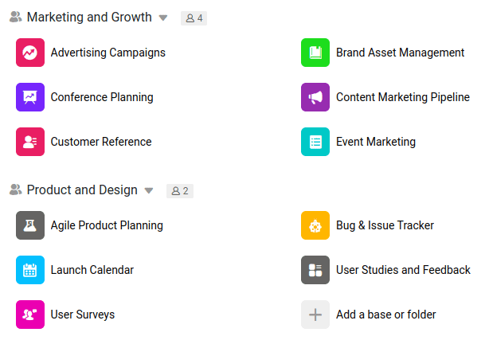

Innerhalb eines Teams hat nicht jedes Teammitglied automatisch Zugriff auf jede Base. Im Gegenteil: Wenn Sie eine neue Base anlegen, haben zunächst nur Sie als Ersteller Zugriff auf diese Base – und es liegt in Ihren Händen, wer gemeinsam an dieser neuen Base arbeiten darf. Für jedes Teammitglied, welches Zugriff auf die Base erhalten soll, muss eine entsprechende Base-Freigabe erstellt werden.

Um diesen immer wiederkehrenden Vorgang der Erstellung von Freigaben zu vereinfachen, gibt es Gruppen in SeaTable. Eine Gruppe ist ein Zusammenschluss von Teammitgliedern, die gemeinsam an Bases arbeiten dürfen. Wenn innerhalb einer Gruppe eine neue Base angelegt wird, haben automatisch alle Teammitglieder Zugriff auf diese Base, ohne dass Freigaben erteilt werden müssen.

Jedes Teammitglied kann seine eigenen Gruppen anlegen und andere Teammitglieder dazu einladen. Sie sollten also Gruppen anlegen, wenn:

- Sie wissen, dass Sie mit mehreren Personen zusammen an vielen verschiedenen Projekten arbeiten werden.
- Sie möchten, dass mehrere Personen alle Informationen und Bases in Ihrer Gruppe sehen können.

Lesen Sie mehr darüber, wie man [eine Gruppe anlegt](https://seatable.io/docs/arbeiten-mit-gruppen/eine-neue-gruppe-anlegen/).

## Andere Teammitglieder zu einer Gruppe einladen

Eine Gruppe hat nur dann einen Sinn, wenn diese mehr als ein Teammitglied hat. Lesen Sie deshalb hier, wie Sie [einer Gruppe neue Teammitglieder hinzufügen](https://seatable.io/docs/gruppenmitglieder-und-berechtigungen/ein-teammitglied-einer-gruppe-hinzufuegen/).

## Berechtigungen innerhalb einer Gruppe

Grundsätzlich kann jedes Gruppenmitglied die Inhalte der Gruppe einsehen. Um in einer Gruppe neue Bases anlegen zu dürfen, muss man jedoch entweder Eigentümer oder Administrator der Gruppe sein. Lesen Sie hier mehr über die verschiedenen [Berechtigungen innerhalb einer Gruppe](https://seatable.io/docs/gruppenmitglieder-und-berechtigungen/gruppenmitglieder-und-ihre-berechtigungen/).

## Teamübergreifende Gruppen

Teamübergreifende Gruppen sind aktuell nicht möglich. Wenn Sie mit jemandem außerhalb Ihres Teams zusammenarbeiten wollen, müssen Sie einen [Einladungslink](https://seatable.io/docs/freigabelinks/einladungs-link-erklaert/) für die entsprechende Base erstellen und dieser Person zuschicken.
