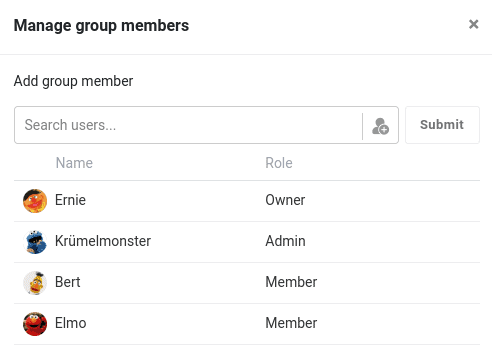

Innerhalb einer SeaTable Gruppe gibt es drei verschiedene Rollen: **Eigentümer**, **Administrator** und **Mitglied**. Abhängig von ihrer Rolle, die von Gruppe zu Gruppe anders sein kann, sind Nutzer zu unterschiedlichen Aktionen berechtigt. Die folgende **Tabelle** verschafft Ihnen einen Überblick, über welche Berechtigungen die einzelnen Rollen verfügen.

## Alle Berechtigungen im Überblick

\[table id=47 /\]

Berechtigungen vergeben

Wenn Sie eine Berechtigung vergeben wollen, hilft Ihnen bestimmt unsere Anleitung [Berechtigungen in einer Gruppe vergeben](https://seatable.io/docs/gruppenmitglieder-und-berechtigungen/berechtigungen-in-einer-gruppe-vergeben/) weiter.

## Welche Gruppen und Bases sieht man?

Jeder Nutzer kann nur die Gruppen sehen, in denen er Mitglied ist. Gruppen und Bases, denen Sie nicht angehören, werden Ihnen natürlich nicht angezeigt.
